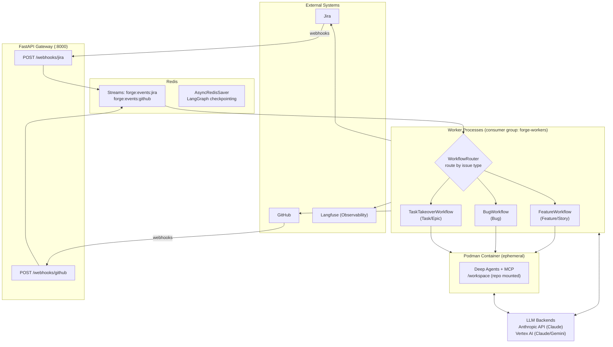
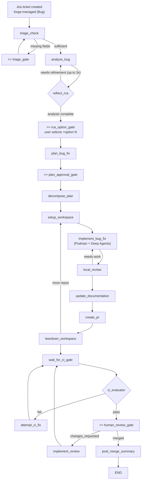
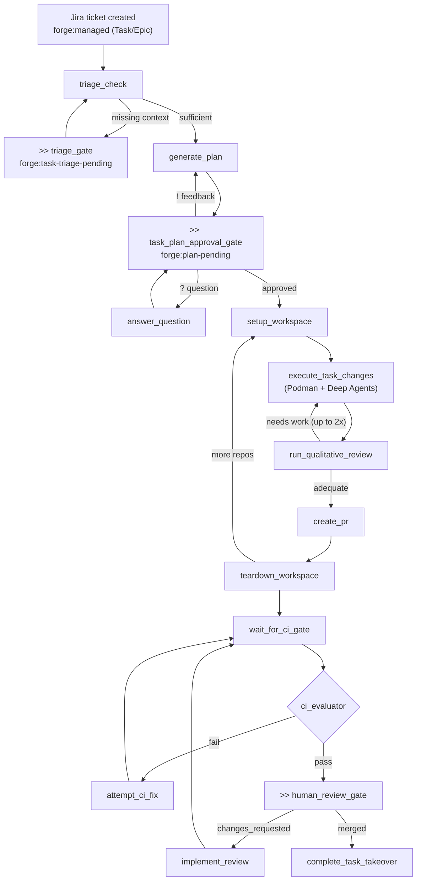

# Forge Architecture

Forge is an AI-powered SDLC orchestrator. It listens for Jira and GitHub events, routes them through LangGraph workflows, and drives implementation end-to-end, from requirements through code generation, CI repair, and human review. This page describes the major components and how they connect.

## System Overview

Forge is built from six layers that form a pipeline from external events to code changes.

- **External Systems:** Jira (ticket lifecycle), GitHub (PRs, CI, code review), and Langfuse (observability and cost tracking). Forge receives webhooks from Jira and GitHub and writes back to both throughout the workflow.
- **FastAPI Server:** A lightweight API layer that validates incoming webhooks and enqueues them as events. It also exposes health and Prometheus metrics endpoints.
- **Redis:** Serves two roles: an event bus (Redis Streams with consumer groups for reliable delivery) and a state store (LangGraph's AsyncRedisSaver checkpoints workflow state per ticket so workflows survive restarts).
- **WorkflowRouter:** The orchestration core. Incoming events are dispatched to one of three LangGraph StateGraph workflows based on Jira issue type: **FeatureWorkflow** (Feature/Story), **BugWorkflow** (Bug), or **TaskTakeoverWorkflow** (Task/Epic). Each workflow is a graph of nodes connected by conditional edges, with human approval gates at key decision points.
- **Podman Container:** Implementation runs in ephemeral rootless containers. Each container mounts the target repository, receives a task description, and uses Deep Agents (an AI coding library) with MCP tool access to make changes and commit them locally. The orchestrator handles pushing and PR creation after the container exits.
- **LLM Backends:** Claude and Gemini models are called bidirectionally. Orchestrator nodes call them for planning and review, and container agents call them for code generation. Forge supports Anthropic's direct API and Vertex AI, selected by configuration.

## Feature Ticket Lifecycle

The Feature workflow handles the largest scope of work. It takes a Jira Feature or Story from a one-line description through a full planning pipeline (PRD, technical spec, epic decomposition, and task breakdown) before any code is written. Each planning stage produces an artifact posted to Jira (or as a GitHub PR in the proposals repo) and pauses at a human approval gate. Reviewers can approve, request revisions with a "!" comment, or ask questions with "?" without advancing the workflow.

Once all planning is approved, Forge groups tasks by target repository and implements them in parallel. Each task runs in its own Podman container. After implementation, Forge reviews the diff, updates documentation, and opens a PR. If CI fails, Forge analyzes the failure and attempts automated fixes (up to 5 times). When CI passes, the workflow pauses for human PR review. Review feedback triggers another implementation-CI cycle. After merge, Forge aggregates status up through tasks, epics, and the parent feature.

`>>` = human checkpoint (auto-approved when forge:yolo label is set)

## Bug Ticket Lifecycle

The Bug workflow starts with triage. Forge checks whether the ticket has enough context to investigate. If information is missing, it pauses and asks the reporter to fill in the gaps. Once the report is sufficient, Forge performs root cause analysis with up to three reflection cycles to refine its understanding. It then presents numbered fix options and waits for the user to select one with a ">option N" comment.

After the user selects a fix approach, Forge generates a fix plan, pauses for approval, and decomposes it into implementation tasks. From there the workflow shares the same implementation path as the Feature workflow: container execution, local review, PR creation, CI repair loop, and human review. After the PR is merged, Forge posts a summary of the fix back to the Jira ticket.

## Task Ticket Lifecycle

The Task workflow is the shortest path from ticket to PR. It handles standalone Jira Tasks and Epics that are already scoped enough to implement directly, without PRD, spec, or epic decomposition. Forge triages the ticket for sufficient context, generates an implementation plan, and pauses for approval. At the approval gate, reviewers can ask questions ("?"), request revisions ("!"), or approve to proceed.

After approval, implementation follows the same container-based execution as the other workflows: Forge sets up a workspace, runs the changes in a Podman container with Deep Agents, reviews the output for quality (up to 2 retries), and opens a PR. The CI repair loop and human review gate work identically to the Feature and Bug workflows.

## Data Flow Summary

- **Inbound events:** Jira/GitHub webhooks --> FastAPI --> Redis Streams
- **State persistence:** Redis (LangGraph AsyncRedisSaver, keyed by ticket)
- **LLM calls:** Orchestrator nodes and container agents --> Claude/Gemini (Anthropic / Vertex AI), bidirectional
- **Code execution:** implement_task --> Podman container --> Deep Agents (library)
- **Outbound actions:** Jira (comments, labels, transitions), GitHub (PRs, branches, reviews)
- **Observability:** Langfuse (LLM traces, workflow spans, costs)
