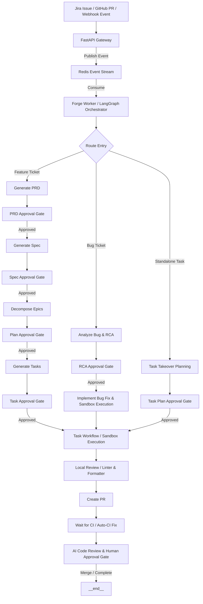

# Global Architecture Documentation

This document describes the global system architecture of Forge—an AI-powered Software Development Lifecycle (SDLC) orchestrator that automates software planning, engineering, and deployment workflows using LangGraph, FastAPI, and Claude.

---

## Introduction

Forge bridges the gap between issue trackers (Jira), version control systems (GitHub), and advanced Language Models (Anthropic Claude). By orchestrating complex, multi-step agentic workflows with checkpointed states, Forge turns high-level product descriptions and bug reports into fully tested and approved pull requests.

### Core Philosophy

1. **Human-in-the-Loop (HITL):** High-trust automated workflows require checkpointing. Forge inserts approval gates at key planning stages (PRD, Spec, Plan, Task) to ensure humans direct the AI rather than just auditing the final code.
2. **Deterministic Orchestration, Agentic Execution:** Workflows are orchestrated using a state-machine model (LangGraph), while tasks inside individual steps (such as code implementation) are delegated to highly agentic, tool-equipped containers (Deep Agents).
3. **State Isolation & Reproducibility:** No task execution runs directly on the host. Every implementation step is containerized, and workflow state is persisted to Redis, allowing resumes and retries.

---

## Scope

This architecture foundation covers:

- **Global Pipeline Flow:** The complete lifecycle of feature implementation, bug triage/fixes, and task takeovers from external triggers to finalized Pull Requests.
- **System Components & Boundaries:** The boundaries and responsibilities of the FastAPI server, Redis Stream queues, LangGraph orchestrator, Integrations, and ephemeral Podman Sandboxes.
- **Workflow State Management:** State retention, event-driven checkpointing, and error-recovery/retry capabilities.

---

## Global Pipeline Flow

Forge features a unified, event-driven ingestion flow that branches into distinct, specialized sub-graphs based on the work type.



### The Three Core Pipeline Flows

#### 1. Feature Lifecycle (Epic/Feature Decomposition)
*   **Generate PRD:** Translates a raw user request into a structured Product Requirements Document (PRD).
*   **Generate Spec:** Converts the approved PRD into a detailed technical specification with behavioral acceptance criteria.
*   **Decompose Epics:** Breaks the specification down into a set of implementable Epics containing high-level execution steps.
*   **Generate Tasks:** Translates Epics into discrete, actionable developer tasks.
*   **Execution:** Executes the tasks sequentially or in parallel inside secure sandboxes.

---

## Feature Workflow State Machine Diagram & Detail

Below is the detailed, 1:1 code-aligned state machine diagram representing the full Feature Workflow managed in `src/forge/workflow/feature/graph.py`.

```mermaid
flowchart TD
    %% Styling and classes
    classDef planning fill:#E1F5FE,stroke:#01579B,stroke-width:2px;
    classDef execution fill:#E8F5E9,stroke:#1B5E20,stroke-width:2px;
    classDef cicd fill:#FFF3E0,stroke:#E65100,stroke-width:2px;
    classDef human fill:#EDE7F6,stroke:#4A148C,stroke-width:2px;
    classDef qa fill:#FFFDE7,stroke:#F57F17,stroke-width:2px;
    classDef terminal fill:#FFEBEE,stroke:#B71C1C,stroke-width:2px;

    %% Nodes
    %% Entry Routing
    route_entry([route_entry]):::planning

    %% Planning States
    generate_prd[generate_prd]:::planning
    prd_approval_gate{prd_approval_gate}:::human
    regenerate_prd[regenerate_prd]:::planning

    generate_spec[generate_spec]:::planning
    spec_approval_gate{spec_approval_gate}:::human
    regenerate_spec[regenerate_spec]:::planning

    decompose_epics[decompose_epics]:::planning
    plan_approval_gate{plan_approval_gate}:::human
    regenerate_all_epics[regenerate_all_epics]:::planning
    update_single_epic[update_single_epic]:::planning

    generate_tasks[generate_tasks]:::planning
    task_approval_gate{task_approval_gate}:::human
    regenerate_all_tasks[regenerate_all_tasks]:::planning
    update_single_task[update_single_task]:::planning
    regenerate_epic_tasks[regenerate_epic_tasks]:::planning

    %% Execution States
    task_router{task_router}:::execution
    setup_workspace[setup_workspace]:::execution
    implement_task[implement_task]:::execution
    local_review[local_review]:::execution
    update_documentation[update_documentation]:::execution
    create_pr[create_pr]:::execution
    teardown_workspace[teardown_workspace]:::execution

    %% CI/CD & Validation States
    wait_for_ci_gate{wait_for_ci_gate}:::cicd
    ci_evaluator{ci_evaluator}:::cicd
    attempt_ci_fix[attempt_ci_fix]:::cicd
    escalate_blocked[escalate_blocked]:::cicd

    %% Human Review States
    human_review_gate{human_review_gate}:::human
    implement_review[implement_review]:::human
    review_response_gate{review_response_gate}:::human

    %% Q&A State
    answer_question[answer_question]:::qa

    %% Rebase State
    rebase_pr[rebase_pr]:::execution

    %% Terminal States
    complete_tasks[complete_tasks]:::terminal
    aggregate_epic_status[aggregate_epic_status]:::terminal
    aggregate_feature_status[aggregate_feature_status]:::terminal
    END([END]):::terminal

    %% Edges / Transitions

    %% Entry Transitions
    route_entry -->|initial / resume generate_prd| generate_prd
    route_entry -->|resume prd_approval_gate| prd_approval_gate
    route_entry -->|resume generate_spec| generate_spec
    route_entry -->|resume regenerate_prd| regenerate_prd
    route_entry -->|resume spec_approval_gate| spec_approval_gate
    route_entry -->|resume regenerate_spec| regenerate_spec
    route_entry -->|resume decompose_epics| decompose_epics
    route_entry -->|resume regenerate_all_epics| regenerate_all_epics
    route_entry -->|resume update_single_epic| update_single_epic
    route_entry -->|resume plan_approval_gate| plan_approval_gate
    route_entry -->|resume generate_tasks| generate_tasks
    route_entry -->|resume regenerate_all_tasks| regenerate_all_tasks
    route_entry -->|resume update_single_task| update_single_task
    route_entry -->|resume regenerate_epic_tasks| regenerate_epic_tasks
    route_entry -->|resume task_approval_gate| task_approval_gate
    route_entry -->|resume task_router / escalate_blocked| task_router
    route_entry -->|resume setup_workspace| setup_workspace
    route_entry -->|resume implement_task| implement_task
    route_entry -->|resume create_pr / blocked| create_pr
    route_entry -->|resume teardown_workspace| teardown_workspace
    route_entry -->|resume local_review| local_review
    route_entry -->|resume update_documentation| update_documentation
    route_entry -->|resume wait_for_ci_gate| wait_for_ci_gate
    route_entry -->|resume ci_evaluator| ci_evaluator
    route_entry -->|resume human_review_gate| human_review_gate
    route_entry -->|resume implement_review| implement_review
    route_entry -->|resume review_response_gate| review_response_gate
    route_entry -->|resume rebase_pr| rebase_pr
    route_entry -->|resume complete_tasks| complete_tasks
    route_entry -->|resume aggregate_epic_status| aggregate_epic_status
    route_entry -->|resume aggregate_feature_status| aggregate_feature_status
    route_entry -->|resume END| END

    %% PRD Flow
    generate_prd -->|success| prd_approval_gate
    generate_prd -->|failure| END
    prd_approval_gate -->|approved| generate_spec
    prd_approval_gate -->|revision feedback| regenerate_prd
    prd_approval_gate -->|question prefix '?'| answer_question
    prd_approval_gate -->|pause / empty| END
    regenerate_prd -->|success| prd_approval_gate
    regenerate_prd -->|failure| END

    %% Spec Flow
    generate_spec -->|success| spec_approval_gate
    generate_spec -->|failure| END
    spec_approval_gate -->|approved| decompose_epics
    spec_approval_gate -->|revision feedback| regenerate_spec
    spec_approval_gate -->|question prefix '?'| answer_question
    spec_approval_gate -->|pause / empty| END
    regenerate_spec -->|success| spec_approval_gate
    regenerate_spec -->|failure| END

    %% Epic Plan Flow
    decompose_epics -->|success| plan_approval_gate
    decompose_epics -->|failure| END
    plan_approval_gate -->|approved| generate_tasks
    plan_approval_gate -->|feature-level rejection| regenerate_all_epics
    plan_approval_gate -->|epic-level rejection| update_single_epic
    plan_approval_gate -->|question prefix '?'| answer_question
    plan_approval_gate -->|pause / empty| END
    regenerate_all_epics -->|success| plan_approval_gate
    regenerate_all_epics -->|failure| END
    update_single_epic -->|success| plan_approval_gate
    update_single_epic -->|failure| END

    %% Task Flow
    generate_tasks -->|success| task_approval_gate
    generate_tasks -->|failure| END
    task_approval_gate -->|approved| task_router
    task_approval_gate -->|feature-level rejection| regenerate_all_tasks
    task_approval_gate -->|epic-level rejection| regenerate_epic_tasks
    task_approval_gate -->|task-level rejection| update_single_task
    task_approval_gate -->|question prefix '?'| answer_question
    task_approval_gate -->|pause / empty| END
    regenerate_all_tasks -->|success| task_approval_gate
    regenerate_all_tasks -->|failure| END
    update_single_task -->|success| task_approval_gate
    update_single_task -->|failure| END
    regenerate_epic_tasks -->|success| task_approval_gate
    regenerate_epic_tasks -->|failure| END

    %% Execution & Workspace Flow
    task_router -->|parallel fan-out (Send)| setup_workspace
    setup_workspace -->|success| implement_task
    setup_workspace -->|failure| escalate_blocked
    implement_task -->|tasks remaining / retry < 3| implement_task
    implement_task -->|all tasks done| local_review
    implement_task -->|failure / retry >= 3| escalate_blocked
    
    local_review -->|local_review| local_review
    local_review -->|create_pr| update_documentation
    update_documentation --> create_pr
    
    create_pr -->|success / partial| teardown_workspace
    create_pr -->|failure| escalate_blocked
    teardown_workspace -->|more repos remaining| setup_workspace
    teardown_workspace -->|no repos remaining| wait_for_ci_gate

    %% CI/CD & Validation Flow
    wait_for_ci_gate -->|is_paused == true| END
    wait_for_ci_gate -->|is_paused == false| ci_evaluator
    ci_evaluator -->|passed| human_review_gate
    ci_evaluator -->|fixing| attempt_ci_fix
    ci_evaluator -->|pending / waiting| END
    ci_evaluator -->|failed / escalate| escalate_blocked
    attempt_ci_fix -->|wait_for_ci_gate / retry| wait_for_ci_gate
    attempt_ci_fix -->|ci_evaluator| ci_evaluator
    attempt_ci_fix -->|escalate_blocked| escalate_blocked
    escalate_blocked --> END

    %% Human Review Flow
    human_review_gate -->|review feedback| implement_review
    human_review_gate -->|approved / merged| complete_tasks
    human_review_gate -->|pause / pending| END
    
    implement_review -->|wait_for_ci_gate| wait_for_ci_gate
    implement_review -->|review_response_gate| review_response_gate
    implement_review -->|implement_review / self-loop| implement_review
    implement_review -->|human_review_gate| human_review_gate
    implement_review -->|escalate_blocked| escalate_blocked
    
    review_response_gate -->|implement_review| implement_review
    review_response_gate -->|human_review_gate| human_review_gate
    review_response_gate -->|pause / pending| END

    %% Q&A Back-routing
    answer_question -->|return to sender| prd_approval_gate
    answer_question -->|return to sender| spec_approval_gate
    answer_question -->|return to sender| plan_approval_gate
    answer_question -->|return to sender| task_approval_gate

    %% Rebase Flow
    rebase_pr -->|resume to current_node| prd_approval_gate
    rebase_pr -->|resume to current_node| spec_approval_gate
    rebase_pr -->|resume to current_node| plan_approval_gate
    rebase_pr -->|resume to current_node| task_approval_gate
    rebase_pr -->|resume to current_node| task_router
    rebase_pr -->|resume to current_node| setup_workspace
    rebase_pr -->|resume to current_node| implement_task
    rebase_pr -->|resume to current_node| local_review
    rebase_pr -->|resume to current_node| update_documentation
    rebase_pr -->|resume to current_node| create_pr
    rebase_pr -->|resume to current_node| teardown_workspace
    rebase_pr -->|resume to current_node| wait_for_ci_gate
    rebase_pr -->|resume to current_node| ci_evaluator
    rebase_pr -->|resume to current_node| human_review_gate
    rebase_pr -->|resume to current_node| implement_review
    rebase_pr -->|resume to current_node| review_response_gate
    rebase_pr -->|resume to current_node| complete_tasks
    rebase_pr -->|resume to current_node| aggregate_epic_status
    rebase_pr -->|resume to current_node| aggregate_feature_status
    rebase_pr -->|resume to current_node| escalate_blocked
    rebase_pr -->|resume to current_node / fallback| END

    %% Post-Implementation Termination Chain
    complete_tasks --> aggregate_epic_status
    aggregate_epic_status --> aggregate_feature_status
    aggregate_feature_status --> END
```

### Detailed State Transitions

#### 1. Entry & Resumability (`route_entry`)
When a Feature workflow starts or is retried/resumed, `route_entry` analyzes the state's `current_node`. It maps the `current_node` to its counterpart node inside the state machine. If no `current_node` exists, it defaults to starting the pipeline at `generate_prd`.

#### 2. Planning Phase
*   **PRD Stage:** `generate_prd` creates the PRD. Success routes to `prd_approval_gate`; failure terminates to `END`. `prd_approval_gate` waits for human feedback. On approval, it goes to `generate_spec`. On rejection (indicated by an exclamation mark `!`), it routes to `regenerate_prd`. Questions starting with `?` or `@forge ask` route to `answer_question`, which handles the query and returns state to `prd_approval_gate`.
*   **Spec Stage:** `generate_spec` is executed upon PRD approval. On success, it routes to `spec_approval_gate`. On rejection, it routes to `regenerate_spec` for correction. Questions trigger `answer_question` routing.
*   **Epic Decomposition Stage:** `decompose_epics` structures the specification into Epic plans. Once processed, it moves to `plan_approval_gate`. A feature-level rejection routes to `regenerate_all_epics`, whereas a targeted Epic rejection routes to `update_single_epic`.
*   **Task Generation Stage:** `generate_tasks` decomposes the Epics into discrete Developer tasks. This routes to `task_approval_gate`. Feedback loops can trigger `regenerate_all_tasks` (feature-level), `regenerate_epic_tasks` (epic-level), or `update_single_task` (individual task level).

#### 3. Execution Phase
*   **Routing & Workspaces:** `task_router` schedules and routes tasks. Workspaces are initialized with `setup_workspace`. If workspace setup fails, it transitions to `escalate_blocked`; otherwise, it proceeds to `implement_task`.
*   **Implementation & Reviews:** `implement_task` is called iteratively until all tasks in a repository are marked completed, or until the maximum retry limit (3 retries) is exceeded (escalating to `escalate_blocked`). Upon completion, `local_review` is called to analyze the git diff, after which `update_documentation` identifies and fixes stale documentation files before `create_pr` builds and publishes the Pull Request. Finally, `teardown_workspace` cleans up the sandbox and advances to either the next repository or to `wait_for_ci_gate`.

#### 4. Validation (CI/CD) Phase
*   **Gateways:** `wait_for_ci_gate` pauses execution if CI is still running. Once CI completes, it transitions to `ci_evaluator`.
*   **Evaluation & Self-Heal:** `ci_evaluator` assesses CI status. If CI passed, it goes to `human_review_gate`. If failing, it goes to `attempt_ci_fix` up to 5 times before giving up and escalating to `escalate_blocked`.

#### 5. Human Review & Termination
*   **Human Review Gate:** `human_review_gate` tracks reviewer reactions and comments on the implementation PR. On approval or merge, it routes to `complete_tasks` to finalize the work items. If review comments require codebase updates, it routes to `implement_review` to analyze and plan fixes.
*   **Implementation Review:** `implement_review` routes either back to `wait_for_ci_gate` to check CI on new commits, to `review_response_gate` to wait for further feedback, back to itself, back to `human_review_gate`, or escalates to `escalate_blocked` on critical failures.
*   **Terminal Chain:** Once all changes are fully merged and approved, `complete_tasks` executes, followed by `aggregate_epic_status` and `aggregate_feature_status` to close out corresponding planning tickets before routing to `END`.

#### 1. Feature Lifecycle (Epic/Feature Decomposition)

#### 2. Bug Triage & Fix Lifecycle (RCA-driven)
*   **Analyze Bug:** Executes tests, inspects code, and produces a structured Root Cause Analysis (RCA) with potential fix options.
*   **RCA Approval Gate:** Holds execution until a developer selects the preferred fix approach.
*   **Implement Bug Fix:** Spawns a sandbox container targeting the specific files and applying the selected RCA solution.

#### 3. Task Takeover Lifecycle (Standalone Tasks)
*   **Task Takeover Planning:** Handles standalone Tasks and Epics already defined in Jira. It maps out target files, step-by-step instructions, and repository scope.
*   **Execution:** Proceeds directly to workspace preparation and sandbox-based execution.

---

## System Component Architecture

```
                                  +-----------------------+
                                  |      Jira Cloud       |
                                  +-----------+-----------+
                                              | Webhooks & API
                                              v
+-----------------------+         +-----------+-----------+
|   GitHub Repository   |<------->|    FastAPI Gateway    |
+-----------------------+  PR/CI  +-----------+-----------+
                                              |
                                              | Produce Events
                                              v
                                  +-----------+-----------+
                                  |   Redis Event Queue   |
                                  +-----------+-----------+
                                              |
                                              | Consume stream
                                              v
                                  +-----------+-----------+         +-----------------------+
                                  |     Forge Worker      |<------->|    Anthropic Claude   |
                                  | (LangGraph Orchestrator)|         |    (via API/Vertex)   |
                                  +-----------+-----------+         +-----------------------+
                                              |
                                              | Spawns task
                                              v
                                  +-----------+-----------+
                                  |    Podman Sandbox     |
                                  | (Ephemeral Agent Container)
                                  +-----------------------+
```

### 1. API Gateway (FastAPI)
The API gateway receives incoming webhooks from Jira (issue creation, comments, transitions) and GitHub (PR updates, reviews, check-run completions). It performs signature verification and publishes standardized payload events to Redis.

### 2. Event Queue & State Checkpointing (Redis)
*   **Redis Streams:** Acts as the reliable, FIFO backplane for event queuing.
*   **State Persistence:** LangGraph stores the state of every active workflow node execution in Redis. If a worker fails or is restarted, the workflow resumes exactly where it left off.

### 3. Orchestration Engine (LangGraph Worker)
The worker consumes from the Redis event queue and runs the state machine. Each node in the graph represents a discrete processing step (e.g., loading prompts, invoking LLMs, querying Jira/GitHub APIs, or spinning up containers). Gates halt state execution until specific human approval labels are applied (e.g., `forge:prd-pending` -> `Approved`).

### 4. Sandbox Execution Environment (Podman)
Actual code modifications, test executions, and linting/formatting happen inside ephemeral, rootless Podman containers.
*   **System Prompt:** Bootstrapped with a specialized agent system instruction.
*   **Isolated Workspace:** Code resides on a local mount inside the container, but external network access is restricted to ensure secure execution.
*   **Deep Agents:** The agent inside the container has access to file editing, shell command execution, and local build tools to implement and verify its changes autonomously.

---

## Isolated Podman Container & Execution Environment Lifecycle

This section details the design, layout, security model, and execution lifecycle of the containerized sandbox environment where task implementation and code execution take place.

### 1. The Host-Worker-to-Container Relationship
The execution environment relies on a 1:1, non-overlapping relationship between a worker task execution and a dedicated, ephemeral container instance:
- **Forge Worker Host:** The global orchestrator or worker pool runs on a host server. When the state machine transitions to an execution or implementation node, it dynamically initializes a `ContainerRunner`.
- **Ephemeral Instance Allocation:** Each workflow task spawns exactly one Podman container instance.
- **Unique Naming & Traceability:** Containers are named with the pattern `forge-{ticket_key}-{unique_hash}` (e.g., `forge-AISOS-189-a1b2c3`) using a UUID hash to prevent collision in multi-pass executions or concurrent runs. This maps the container execution state and host metrics back to specific Jira tickets and GitHub PR branches.

### 2. Container Construction and Image Layout
The sandbox image (`localhost/forge-dev:latest` by default) is built on top of a highly robust foundation designed for development containers:
- **Base Image:** `mcr.microsoft.com/devcontainers/universal:linux`, providing pre-installed toolchains for Python, Node.js, Go, Rust, Java, and common development tools.
- **Agent Integration Layer:** Bundles `deepagents` (the autonomous tool-use framework), `anthropic` and `langchain` clients for cognitive capabilities, and `langchain-mcp-adapters` for Model Context Protocol interactions.
- **Context7 Integration:** Configured with Upstash's `@upstash/context7-mcp` NPM package to resolve, download, and query up-to-date third-party programming documentation securely.

### 3. Isolation Patterns and Workspace Mappings
The sandbox ensures total file system and network isolation while allowing autonomous modifications of the targeted codebase:
- **Workspace Volume Mount:** The local clone of the target repository is mounted from the host into the container filesystem at `/workspace` with the `:Z` SELinux relabeling flag:
  `podman run -v /host/path/to/workspace:/workspace:Z`
- **Dynamic Task Payload Injection:** A temporary metadata payload containing the task specification is written by the runner to `.forge/task.json` inside the workspace directory, then mounted read-only to `/task.json` in the container.
- **Skill Mounts:** Specialized capability libraries are resolved dynamically on the host and mounted read-only at `/skills/skill_{n}:ro,Z`.
- **Resource Constraints:** Containers are strictly bounded using native Podman control groups (cgroups) to prevent resource exhaustion or denial-of-service on the worker host:
  - `--memory 4g` (or custom limit via `container_memory` config)
  - `--cpus 2` (or custom limit via `container_cpus` config)
- **Network Isolation:** Rootless containers run using `slirp4netns` to restrict host network interface exposure.

### 4. Environment Variable and Credential Security
To maintain a zero-trust architecture, sensitive credentials on the worker host are shielded and selectively exposed using narrow-scope environment injection:
- **Credential Masking:** Raw credentials are kept as pydantic Secrets on the host and passed to the container's virtual environment only at runtime using the `-e` flag (e.g., `-e ANTHROPIC_API_KEY=...`).
- **Cloud Credential Isolation:** For Vertex AI authentication, the Google Application Default Credentials (ADC) JSON file is mounted read-only (`-v /path/to/adc.json:/root/.config/gcloud/...:ro,Z`), avoiding persistent storage of GCP tokens in the image or workspace filesystem.
- **Developer Attribution:** User identity details (git user name/email) are injected via env vars (`GIT_USER_NAME`, `GIT_USER_EMAIL`) and applied within the container to configure git globally prior to commit generation.

### 5. Task Execution Lifecycle & Entrypoint Protocol
When a container is started, its behavior is strictly orchestrated by `entrypoint.py`:
1. **Bootstrap & Configuration:** Reads variables, configures global git settings, and loads repository-specific guardrails (such as `CLAUDE.md` and `AGENTS.md`).
2. **Context Resolution:** Rebuilds the system prompt from `FORGE_SYSTEM_PROMPT_TEMPLATE` by interpolating task metadata from `/task.json`. Loads Context7 MCP tools for documentation lookup.
3. **Agent Action:** Instantiates `create_deep_agent` with a `LocalShellBackend` targeting `/workspace` with a default 10-minute operation timeout, executing autonomous steps.
4. **Validation and Verification:** Detects the repository test runner (e.g., `pytest`, `go test`, `npm test`) and runs tests. If tests fail, it can retry task execution up to the configured limit (`max-retries`).
5. **Git Commit Creation:** Stages code modifications and newly created files while explicitly excluding `.forge/` and non-tracked runtime files, then generates a structured commit.
6. **Execution Signals:** The container terminates and returns an explicit exit code mapping the outcome:
   - `0` (Success)
   - `1` (Task execution failed)
   - `2` (Tests failed after max retries)
   - `3` (Configuration or runtime bootstrap error)

### 6. Container Teardown and Preservation Policies
Once execution finishes, the worker orchestrator handles cleanup and debug availability:
- **Clean Execution (Default):** The runner runs with `--rm` enabled, prompting Podman to automatically remove the container, free up isolated namespaces, and reclaim disk space immediately upon termination.
- **Fail-Safe Cleanup:** If a task times out, the runner halts the container gracefully via `podman stop -t 10`. If unresponsive, it issues a `podman kill` to terminate all subprocesses.
- **Preservation Mode (`FORGE_CONTAINER_KEEP=true`):** To aid debugging, container destruction can be disabled when failures occur. The runner logs the persistent container ID, offering immediate diagnostic commands:
  - `podman logs <container_name>` (access stdout/stderr)
  - `podman export <container_name> | tar -xC /tmp/<container_name>` (inspect filesystem state)
  - `podman rm <container_name>` (manual disposal once completed)

---

## State and Resumability

Every node execution transition represents a state checkpoint. 
- **Graceful Retries:** If an LLM call fails, or an API request rate-limits, the orchestrator retries using exponential backoff.
- **Interactive Recovery:** If a step is blocked (marked with the label `forge:blocked`), human comments or the label `forge:retry` will trigger a resume from the last known-good checkpoint.
- **YOLO Mode:** Applying the `forge:yolo` label programmatically bypasses all planning-stage approval gates, running the pipeline fully autonomously from ticket to implementation PR.

---

## Feature Workflow Detailed Phase Summaries & Mechanics

The Feature implementation workflow is composed of three distinct execution stages: the **Planning Phase**, the **Execution Phase**, and the **CI/CD Validation & Review Phase**.

### 1. The Planning Phase & Human Approval Gates

The Planning Phase focuses on converting raw, high-level user tickets into concrete, structured, and approved execution plans. It establishes strict alignment between product design and technical execution through multi-stage **Human-in-the-Loop (HITL)** approval gates and revision-feedback loops.

```
       Jira / User Input
               │
               ▼
┌──────────────────────────────┐
│         generate_prd         │
└──────────────┬───────────────┘
               ▼
┌──────────────────────────────┐     ! Revision Request     ┌──────────────────────────────┐
│      prd_approval_gate       ├───────────────────────────>│        regenerate_prd        │
└──────────────┬───────────────┘                            └──────────────┬───────────────┘
               │                                                           ▲
               │ Approved                                                  │
               ▼                                                           │
┌──────────────────────────────┐                                           │
│        generate_spec         │                                           │
└──────────────┬───────────────┘                                           │
               ▼                                                           │
┌──────────────────────────────┐     ! Revision Request     ┌──────────────┴───────────────┐
│      spec_approval_gate      ├───────────────────────────>│       regenerate_spec        │
└──────────────┬───────────────┘                            └──────────────────────────────┘
               │
               │ Approved
               ▼
┌──────────────────────────────┐
│       decompose_epics        │
└──────────────┬───────────────┘
               ▼
┌──────────────────────────────┐     ! Revision Request     ┌──────────────────────────────┐
│      plan_approval_gate      ├───────────────────────────>│     regenerate_all_epics     │
└──────────────┬───────────────┘                            │              or              │
               │                                            │      update_single_epic      │
               │ Approved                                   └──────────────────────────────┘
               ▼
┌──────────────────────────────┐
│        generate_tasks        │
└──────────────┬───────────────┘
               ▼
┌──────────────────────────────┐     ! Revision Request     ┌──────────────────────────────┐
│      task_approval_gate      ├───────────────────────────>│     regenerate_all_tasks     │
└──────────────┬───────────────┘                            │    regenerate_epic_tasks     │
               │                                            │              or              │
               │ Approved                                   │      update_single_task      │
               ▼                                            └──────────────────────────────┘
     To task_router Node
```

#### Detailed Execution Stages
*   **PRD Generation (`generate_prd`):** Triggered by an initial Jira ticket or webhook event, Forge consumes the raw issue description. An LLM node parses this input and drafts a comprehensive, structured **Product Requirements Document (PRD)** outlining requirements, user stories, scope, and non-functional requirements.
*   **PRD Approval Gate (`prd_approval_gate`):** The workflow pauses. If PRD Proposals are enabled for the project, Forge opens a pull request in the designated proposals repository containing `prd.md`. Otherwise, it posts the PRD as a comment on the Jira ticket and marks it with the `forge:prd-pending` label. 
*   **Spec Generation (`generate_spec`):** Once the PRD is approved, Forge consumes it to generate a detailed **Technical Specification (`design.md`)** detailing systemic changes, file targets, architecture decisions, and behavioral acceptance criteria.
*   **Spec Approval Gate (`spec_approval_gate`):** Forge halts for technical review. The spec is published via proposal PR or a Jira comment labeled `forge:spec-pending`.
*   **Epic Decomposition (`decompose_epics`):** The approved spec is analyzed to decompose the monolithic feature into implementable **Epics** with concrete technical plans.
*   **Plan Approval Gate (`plan_approval_gate`):** Halts and applies `forge:plan-pending`. Allows engineers to review the feature decomposition.
*   **Task Generation (`generate_tasks`):** Translates approved Epics into highly specific, actionable, and discrete development **Tasks**.
*   **Task Approval Gate (`task_approval_gate`):** The final gate of the Planning Phase (`forge:task-pending`). Once tasks are approved, the workflow enters the Execution Phase.

#### The Revision Gate and Feedback Loop Mechanism
Every approval gate in the Planning Phase contains a reactive, bi-directional feedback mechanism:
1.  **Approval Signals:** Merging the proposals PR or posting a Jira comment without a revision prefix transitions the state machine to the next generation node.
2.  **Revision Signals:** Reviewers can request revisions at any gate. On Jira, a comment starting with the exclamation prefix `!` (e.g., `! Please support PostgreSQL besides SQLite`) triggers a transition to a regeneration node. In PR proposals, pushing a change or providing review comments acts as the trigger.
3.  **Context-Aware Regeneration:** The state machine routes back to the appropriate regeneration node (e.g., `regenerate_prd`, `regenerate_spec`, `update_single_epic`, `update_single_task`). The regeneration node takes the previous artifact draft, appends the user's specific feedback, and invokes the LLM with a targeted refinement prompt to produce an updated draft.
4.  **Re-entry & Re-evaluation:** Once regenerated, the updated artifact is re-published, and the state machine loops back to the corresponding approval gate, restarting the review cycle.

---

### 2. The Execution Phase & Repository Fan-Out parallelization

The Execution Phase implements the approved task list across one or more target repositories. It leverages dynamic parallelization to optimize implementation speed and ensure clean, isolated code execution environments.

#### Repository Fan-Out and Parallel Routing Mechanics
When the state machine transitions to `task_router`, it analyzes the list of approved tasks and groups them by their target repository (`tasks_by_repo`).

```
                              ┌──────────────────┐
                              │   task_router    │
                              └────────┬─────────┘
                                       │
                    Route tasks parallel (Send API fan-out)
                                       │
         ┌─────────────────────────────┼─────────────────────────────┐
         ▼                             ▼                             ▼
┌──────────────────┐          ┌──────────────────┐          ┌──────────────────┐
│ setup_workspace  │          │ setup_workspace  │          │ setup_workspace  │
│     (Repo A)     │          │     (Repo B)     │          │     (Repo C)     │
└────────┬─────────┘          └────────┬─────────┘          └────────┬─────────┘
         ▼                             ▼                             ▼
┌──────────────────┐          ┌──────────────────┐          ┌──────────────────┐
│  implement_task  │          │  implement_task  │          │  implement_task  │
│  (Sandbox Pod)   │          │  (Sandbox Pod)   │          │  (Sandbox Pod)   │
└────────┬─────────┘          └────────┬─────────┘          └────────┬─────────┘
         ▼                             ▼                             ▼
┌──────────────────┐          ┌──────────────────┐          ┌──────────────────┐
│   local_review   │          │   local_review   │          │   local_review   │
└────────┬─────────┘          └────────┬─────────┘          └────────┬─────────┘
         ▼                             ▼                             ▼
┌──────────────────┐          ┌──────────────────┐          ┌──────────────────┐
│update_doc / PR   │          │update_doc / PR   │          │update_doc / PR   │
└────────┬─────────┘          └────────┬─────────┘          └────────┬─────────┘
         ▼                             ▼                             ▼
┌──────────────────┐          ┌──────────────────┐          ┌──────────────────┐
│teardown_workspace│          │teardown_workspace│          │teardown_workspace│
└────────┬─────────┘          └────────┬─────────┘          └────────┬─────────┘
         │                             │                             │
         └─────────────────────────────┼─────────────────────────────┘
                                       │
                                       ▼
                       Aggregate parallel results (fan-in)
                                       │
                                       ▼
                              wait_for_ci_gate
```

*   **Dynamic Parallel Routing (`route_tasks_parallel`):** If parallel execution is enabled (`parallel_execution_enabled: True`) and multiple repositories require changes, `task_router` bypasses sequential loops and invokes `route_tasks_parallel`.
*   **LangGraph Send API Fan-out:** Forge leverages LangGraph’s `Send` API to dynamically spawn concurrent execution branches. For each target repository (bounded by `MAX_CONCURRENT_REPOS = 5` to prevent resource starvation), a unique sub-state dictionary is prepared. This contains an isolated `current_repo` identifier and branch markers, dispatching parallel execution branches to `setup_workspace` simultaneously.
*   **Execution Isolation:** Because each branch has its own isolated state scope, they execute in complete isolation on the LangGraph worker. They spawn independent rootless Podman containers, avoiding race conditions or dirty directory states.
*   **Result Aggregation (Fan-in):** Once all parallel repository branches run to completion (or block/fail), the orchestrator intercepts them at a join node (`aggregate_parallel_results`). It merges PR URLs, completed repositories list, implemented task logs, and handles error propagation before routing to the global CI/CD gate.

#### Core Execution Nodes & Workspace Lifecycle
Each repository execution branch navigates through five sequential steps:
1.  **Workspace Setup (`setup_workspace`):** A clean clone of the target repository is fetched from GitHub, checked out to a newly created branch named after the ticket (e.g., `forge/feature/AISOS-2169`), and mounted to the host path.
2.  **Code Implementation (`implement_task`):** Forge prepares `.forge/task.json` and spins up the ephemeral Podman sandbox container. The containerized Deep Agent acts autonomously, editing target files and running local test suites iteratively. If execution fails, the state machine allows up to 3 retries.
3.  **Local Code Review (`local_review`):** The local workspace code-review loop runs formatting (e.g., `ruff format`, `gofmt`) and linting (`ruff check`, `go vet`). The linter feedback is fed directly back to the agent inside the container to fix syntax and style issues in-place before committing.
4.  **Documentation Updates (`update_documentation`):** Forge automatically detects changes to public APIs, structures, and configuration files. It scans the repository's documentation directory, identifies stale or outdated markdown files, and applies minimal, targeted documentation edits to keep guides in sync with code changes.
5.  **PR Creation (`create_pr`) & Workspace Teardown (`teardown_workspace`):** Code changes are staged, committed with a standardized structured commit message, and pushed to GitHub. A Pull Request is created, and `teardown_workspace` removes host mounts, halts and deletes the Podman container, and releases resources.

---

### 3. The CI/CD Validation & Review Phase

The Validation & Review Phase guarantees the robustness and security of the code contributions through autonomous self-healing, test suites execution, and rigorous human PR reviews.

```
       PR Published
            │
            ▼
┌──────────────────────────────┐
│       wait_for_ci_gate       │<─────────────────────────────┐
└──────────────┬───────────────┘                              │
               ▼                                              │
┌──────────────────────────────┐                              │ Retry Loop
│         ci_evaluator         │                              │ (Max 5 attempts)
└──────────────┬───────────────┘                              │
               │                                              │
               ├───────────────────> attempt_ci_fix ──────────┘
               │ Failing CI Check
               │
               │ Passed CI Checks
               ▼
┌──────────────────────────────┐
│      human_review_gate       │
└──────────────┬───────────────┘
               │ Approved / Merged
               ▼
┌──────────────────────────────┐
│        complete_tasks        │
└──────────────┬───────────────┘
               ▼
              END
```

#### Self-Healing Loops and the 5-Attempt CI Fix Limit
Once a Pull Request is successfully created, Forge subscribes to GitHub Check Runs and Actions webhooks.

*   **CI Evaluator Gate (`wait_for_ci_gate` & `ci_evaluator`):** Forge waits for all remote CI status checks to complete. When status updates arrive, `ci_evaluator` parses the check-run logs, compiling any standard output, error dumps, and stack traces of failing tests.
*   **Autonomous CI Fix (`attempt_ci_fix`):** If any CI validation checks fail, Forge initiates an autonomous self-healing cycle. It triggers `attempt_ci_fix` which reads the build logs, identifies compiling errors or unit test regressions, and spins up a dedicated Podman sandbox container with the `analyze-ci` and `fix-ci` skills. The agent patches the workspace code, runs local tests, generates a fix commit, and pushes the modifications directly to the active PR branch.
*   **The 5-Attempt Retry Cap:** To prevent infinite execution loops and billing runaways on complex system failures, the self-healing cycle is capped. Forge tracks the attempt counter (`ci_fix_attempts`).
    *   **Attempts < 5:** Forge posts a progress comment on the PR detailing the failure and the planned remedy, triggers the patch commit, and routes back to `wait_for_ci_gate` to await the new CI build execution.
    *   **Attempts >= 5:** If CI continues to fail after the fifth remediation commit, Forge suspends the loop. It transitions the state machine to `escalate_blocked`, marks the ticket/PR with the `forge:blocked` label, and posts a comprehensive summary of the failures, logs, and attempted patches to Jira/GitHub, escalating the ticket to human developers for manual intervention.

#### PR Review, Human Gate, and Final Merge Logic
*   **The Human Review Gate (`human_review_gate`):** Once CI passes successfully, the state machine transitions to `human_review_gate`. Forge leaves a status message indicating the code is ready for review and waits for engineer feedback.
*   **AI Code Review (`review-code`):** While waiting, Forge runs its internal code-reviewer skill to inspect the diff against PRD/Spec requirements, adding helpful comments directly on lines of code to assist the human reviewer.
*   **Interactive Review Feedback (`implement_review`):** If human reviewers leave requested changes or comment on the PR, Forge detects these comments. It transitions to `implement_review` to plan corrections, spawns a container to apply the feedback, and pushes updates to the PR, subsequently routing back to `wait_for_ci_gate` to re-validate the CI tests.
*   **PR Merge and Closeout (`complete_tasks`):** When a human reviewer approves and merges the Pull Request, Forge receives the merge event. The state machine transitions to `complete_tasks` which marks all associated Jira tasks as completed, transitions the parent Epic and Feature tickets, and terminates gracefully to `END`.
