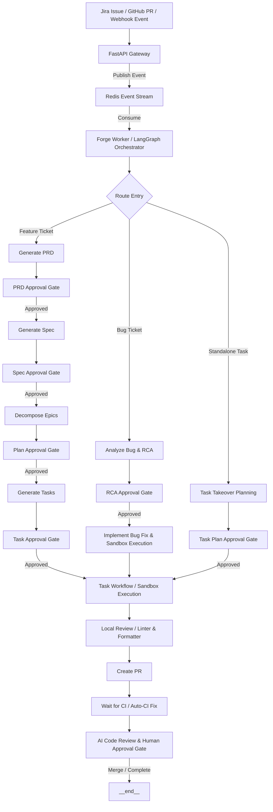

# Global Architecture Documentation

This document describes the global system architecture of Forge—an AI-powered Software Development Lifecycle (SDLC) orchestrator that automates software planning, engineering, and deployment workflows using LangGraph, FastAPI, and Claude.

---

## Introduction

Forge bridges the gap between issue trackers (Jira), version control systems (GitHub), and advanced Language Models (Anthropic Claude). By orchestrating complex, multi-step agentic workflows with checkpointed states, Forge turns high-level product descriptions and bug reports into fully tested and approved pull requests.

### Core Philosophy

1. **Human-in-the-Loop (HITL):** High-trust automated workflows require checkpointing. Forge inserts approval gates at key planning stages (PRD, Spec, Plan, Task) to ensure humans direct the AI rather than just auditing the final code.
2. **Deterministic Orchestration, Agentic Execution:** Workflows are orchestrated using a state-machine model (LangGraph), while tasks inside individual steps (such as code implementation) are delegated to highly agentic, tool-equipped containers (Deep Agents).
3. **State Isolation & Reproducibility:** No task execution runs directly on the host. Every implementation step is containerized, and workflow state is persisted to Redis, allowing resumes and retries.

---

## Scope

This architecture foundation covers:

- **Global Pipeline Flow:** The complete lifecycle of feature implementation, bug triage/fixes, and task takeovers from external triggers to finalized Pull Requests.
- **System Components & Boundaries:** The boundaries and responsibilities of the FastAPI server, Redis Stream queues, LangGraph orchestrator, Integrations, and ephemeral Podman Sandboxes.
- **Workflow State Management:** State retention, event-driven checkpointing, and error-recovery/retry capabilities.

---

## Global Pipeline Flow

Forge features a unified, event-driven ingestion flow that branches into distinct, specialized sub-graphs based on the work type.



### The Three Core Pipeline Flows

#### 1. Feature Lifecycle (Epic/Feature Decomposition)
*   **Generate PRD:** Translates a raw user request into a structured Product Requirements Document (PRD).
*   **Generate Spec:** Converts the approved PRD into a detailed technical specification with behavioral acceptance criteria.
*   **Decompose Epics:** Breaks the specification down into a set of implementable Epics containing high-level execution steps.
*   **Generate Tasks:** Translates Epics into discrete, actionable developer tasks.
*   **Execution:** Executes the tasks sequentially or in parallel inside secure sandboxes.

#### 2. Bug Triage & Fix Lifecycle (RCA-driven)
*   **Analyze Bug:** Executes tests, inspects code, and produces a structured Root Cause Analysis (RCA) with potential fix options.
*   **RCA Approval Gate:** Holds execution until a developer selects the preferred fix approach.
*   **Implement Bug Fix:** Spawns a sandbox container targeting the specific files and applying the selected RCA solution.

#### 3. Task Takeover Lifecycle (Standalone Tasks)
*   **Task Takeover Planning:** Handles standalone Tasks and Epics already defined in Jira. It maps out target files, step-by-step instructions, and repository scope.
*   **Execution:** Proceeds directly to workspace preparation and sandbox-based execution.

---

## System Component Architecture

```
                                  +-----------------------+
                                  |      Jira Cloud       |
                                  +-----------+-----------+
                                              | Webhooks & API
                                              v
+-----------------------+         +-----------+-----------+
|   GitHub Repository   |<------->|    FastAPI Gateway    |
+-----------------------+  PR/CI  +-----------+-----------+
                                              |
                                              | Produce Events
                                              v
                                  +-----------+-----------+
                                  |   Redis Event Queue   |
                                  +-----------+-----------+
                                              |
                                              | Consume stream
                                              v
                                  +-----------+-----------+         +-----------------------+
                                  |     Forge Worker      |<------->|    Anthropic Claude   |
                                  | (LangGraph Orchestrator)|         |    (via API/Vertex)   |
                                  +-----------+-----------+         +-----------------------+
                                              |
                                              | Spawns task
                                              v
                                  +-----------+-----------+
                                  |    Podman Sandbox     |
                                  | (Ephemeral Agent Container)
                                  +-----------------------+
```

### 1. API Gateway (FastAPI)
The API gateway receives incoming webhooks from Jira (issue creation, comments, transitions) and GitHub (PR updates, reviews, check-run completions). It performs signature verification and publishes standardized payload events to Redis.

### 2. Event Queue & State Checkpointing (Redis)
*   **Redis Streams:** Acts as the reliable, FIFO backplane for event queuing.
*   **State Persistence:** LangGraph stores the state of every active workflow node execution in Redis. If a worker fails or is restarted, the workflow resumes exactly where it left off.

### 3. Orchestration Engine (LangGraph Worker)
The worker consumes from the Redis event queue and runs the state machine. Each node in the graph represents a discrete processing step (e.g., loading prompts, invoking LLMs, querying Jira/GitHub APIs, or spinning up containers). Gates halt state execution until specific human approval labels are applied (e.g., `forge:prd-pending` -> `Approved`).

### 4. Sandbox Execution Environment (Podman)
Actual code modifications, test executions, and linting/formatting happen inside ephemeral, rootless Podman containers.
*   **System Prompt:** Bootstrapped with a specialized agent system instruction.
*   **Isolated Workspace:** Code resides on a local mount inside the container, but external network access is restricted to ensure secure execution.
*   **Deep Agents:** The agent inside the container has access to file editing, shell command execution, and local build tools to implement and verify its changes autonomously.

---

## Isolated Podman Container & Execution Environment Lifecycle

This section details the design, layout, security model, and execution lifecycle of the containerized sandbox environment where task implementation and code execution take place.

### 1. The Host-Worker-to-Container Relationship
The execution environment relies on a 1:1, non-overlapping relationship between a worker task execution and a dedicated, ephemeral container instance:
- **Forge Worker Host:** The global orchestrator or worker pool runs on a host server. When the state machine transitions to an execution or implementation node, it dynamically initializes a `ContainerRunner`.
- **Ephemeral Instance Allocation:** Each workflow task spawns exactly one Podman container instance.
- **Unique Naming & Traceability:** Containers are named with the pattern `forge-{ticket_key}-{unique_hash}` (e.g., `forge-AISOS-189-a1b2c3`) using a UUID hash to prevent collision in multi-pass executions or concurrent runs. This maps the container execution state and host metrics back to specific Jira tickets and GitHub PR branches.

### 2. Container Construction and Image Layout
The sandbox image (`localhost/forge-dev:latest` by default) is built on top of a highly robust foundation designed for development containers:
- **Base Image:** `mcr.microsoft.com/devcontainers/universal:linux`, providing pre-installed toolchains for Python, Node.js, Go, Rust, Java, and common development tools.
- **Agent Integration Layer:** Bundles `deepagents` (the autonomous tool-use framework), `anthropic` and `langchain` clients for cognitive capabilities, and `langchain-mcp-adapters` for Model Context Protocol interactions.
- **Context7 Integration:** Configured with Upstash's `@upstash/context7-mcp` NPM package to resolve, download, and query up-to-date third-party programming documentation securely.

### 3. Isolation Patterns and Workspace Mappings
The sandbox ensures total file system and network isolation while allowing autonomous modifications of the targeted codebase:
- **Workspace Volume Mount:** The local clone of the target repository is mounted from the host into the container filesystem at `/workspace` with the `:Z` SELinux relabeling flag:
  `podman run -v /host/path/to/workspace:/workspace:Z`
- **Dynamic Task Payload Injection:** A temporary metadata payload containing the task specification is written by the runner to `.forge/task.json` inside the workspace directory, then mounted read-only to `/task.json` in the container.
- **Skill Mounts:** Specialized capability libraries are resolved dynamically on the host and mounted read-only at `/skills/skill_{n}:ro,Z`.
- **Resource Constraints:** Containers are strictly bounded using native Podman control groups (cgroups) to prevent resource exhaustion or denial-of-service on the worker host:
  - `--memory 4g` (or custom limit via `container_memory` config)
  - `--cpus 2` (or custom limit via `container_cpus` config)
- **Network Isolation:** Rootless containers run using `slirp4netns` to restrict host network interface exposure.

### 4. Environment Variable and Credential Security
To maintain a zero-trust architecture, sensitive credentials on the worker host are shielded and selectively exposed using narrow-scope environment injection:
- **Credential Masking:** Raw credentials are kept as pydantic Secrets on the host and passed to the container's virtual environment only at runtime using the `-e` flag (e.g., `-e ANTHROPIC_API_KEY=...`).
- **Cloud Credential Isolation:** For Vertex AI authentication, the Google Application Default Credentials (ADC) JSON file is mounted read-only (`-v /path/to/adc.json:/root/.config/gcloud/...:ro,Z`), avoiding persistent storage of GCP tokens in the image or workspace filesystem.
- **Developer Attribution:** User identity details (git user name/email) are injected via env vars (`GIT_USER_NAME`, `GIT_USER_EMAIL`) and applied within the container to configure git globally prior to commit generation.

### 5. Task Execution Lifecycle & Entrypoint Protocol
When a container is started, its behavior is strictly orchestrated by `entrypoint.py`:
1. **Bootstrap & Configuration:** Reads variables, configures global git settings, and loads repository-specific guardrails (such as `CLAUDE.md` and `AGENTS.md`).
2. **Context Resolution:** Rebuilds the system prompt from `FORGE_SYSTEM_PROMPT_TEMPLATE` by interpolating task metadata from `/task.json`. Loads Context7 MCP tools for documentation lookup.
3. **Agent Action:** Instantiates `create_deep_agent` with a `LocalShellBackend` targeting `/workspace` with a default 10-minute operation timeout, executing autonomous steps.
4. **Validation and Verification:** Detects the repository test runner (e.g., `pytest`, `go test`, `npm test`) and runs tests. If tests fail, it can retry task execution up to the configured limit (`max-retries`).
5. **Git Commit Creation:** Stages code modifications and newly created files while explicitly excluding `.forge/` and non-tracked runtime files, then generates a structured commit.
6. **Execution Signals:** The container terminates and returns an explicit exit code mapping the outcome:
   - `0` (Success)
   - `1` (Task execution failed)
   - `2` (Tests failed after max retries)
   - `3` (Configuration or runtime bootstrap error)

### 6. Container Teardown and Preservation Policies
Once execution finishes, the worker orchestrator handles cleanup and debug availability:
- **Clean Execution (Default):** The runner runs with `--rm` enabled, prompting Podman to automatically remove the container, free up isolated namespaces, and reclaim disk space immediately upon termination.
- **Fail-Safe Cleanup:** If a task times out, the runner halts the container gracefully via `podman stop -t 10`. If unresponsive, it issues a `podman kill` to terminate all subprocesses.
- **Preservation Mode (`FORGE_CONTAINER_KEEP=true`):** To aid debugging, container destruction can be disabled when failures occur. The runner logs the persistent container ID, offering immediate diagnostic commands:
  - `podman logs <container_name>` (access stdout/stderr)
  - `podman export <container_name> | tar -xC /tmp/<container_name>` (inspect filesystem state)
  - `podman rm <container_name>` (manual disposal once completed)

---

## State and Resumability

Every node execution transition represents a state checkpoint. 
- **Graceful Retries:** If an LLM call fails, or an API request rate-limits, the orchestrator retries using exponential backoff.
- **Interactive Recovery:** If a step is blocked (marked with the label `forge:blocked`), human comments or the label `forge:retry` will trigger a resume from the last known-good checkpoint.
- **YOLO Mode:** Applying the `forge:yolo` label programmatically bypasses all planning-stage approval gates, running the pipeline fully autonomously from ticket to implementation PR.
