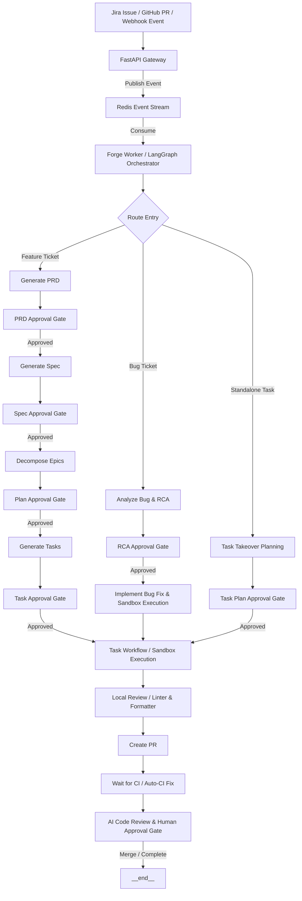

# Global Architecture Documentation

This document describes the global system architecture of Forge—an AI-powered Software Development Lifecycle (SDLC) orchestrator that automates software planning, engineering, and deployment workflows using LangGraph, FastAPI, and Claude.

---

## Introduction

Forge bridges the gap between issue trackers (Jira), version control systems (GitHub), and advanced Language Models (Anthropic Claude). By orchestrating complex, multi-step agentic workflows with checkpointed states, Forge turns high-level product descriptions and bug reports into fully tested and approved pull requests.

### Core Philosophy

1. **Human-in-the-Loop (HITL):** High-trust automated workflows require checkpointing. Forge inserts approval gates at key planning stages (PRD, Spec, Plan, Task) to ensure humans direct the AI rather than just auditing the final code.
2. **Deterministic Orchestration, Agentic Execution:** Workflows are orchestrated using a state-machine model (LangGraph), while tasks inside individual steps (such as code implementation) are delegated to highly agentic, tool-equipped containers (Deep Agents).
3. **State Isolation & Reproducibility:** No task execution runs directly on the host. Every implementation step is containerized, and workflow state is persisted to Redis, allowing resumes and retries.

---

## Scope

This architecture foundation covers:

- **Global Pipeline Flow:** The complete lifecycle of feature implementation, bug triage/fixes, and task takeovers from external triggers to finalized Pull Requests.
- **System Components & Boundaries:** The boundaries and responsibilities of the FastAPI server, Redis Stream queues, LangGraph orchestrator, Integrations, and ephemeral Podman Sandboxes.
- **Workflow State Management:** State retention, event-driven checkpointing, and error-recovery/retry capabilities.

---

## Global Pipeline Flow

Forge features a unified, event-driven ingestion flow that branches into distinct, specialized sub-graphs based on the work type.



### The Three Core Pipeline Flows

#### 1. Feature Lifecycle (Epic/Feature Decomposition)
*   **Generate PRD:** Translates a raw user request into a structured Product Requirements Document (PRD).
*   **Generate Spec:** Converts the approved PRD into a detailed technical specification with behavioral acceptance criteria.
*   **Decompose Epics:** Breaks the specification down into a set of implementable Epics containing high-level execution steps.
*   **Generate Tasks:** Translates Epics into discrete, actionable developer tasks.
*   **Execution:** Executes the tasks sequentially or in parallel inside secure sandboxes.

#### 2. Bug Triage & Fix Lifecycle (RCA-driven)
*   **Analyze Bug:** Executes tests, inspects code, and produces a structured Root Cause Analysis (RCA) with potential fix options.
*   **RCA Approval Gate:** Holds execution until a developer selects the preferred fix approach.
*   **Implement Bug Fix:** Spawns a sandbox container targeting the specific files and applying the selected RCA solution.

#### 3. Task Takeover Lifecycle (Standalone Tasks)
*   **Task Takeover Planning:** Handles standalone Tasks and Epics already defined in Jira. It maps out target files, step-by-step instructions, and repository scope.
*   **Execution:** Proceeds directly to workspace preparation and sandbox-based execution.

---

## System Component Architecture

```
                                  +-----------------------+
                                  |      Jira Cloud       |
                                  +-----------+-----------+
                                              | Webhooks & API
                                              v
+-----------------------+         +-----------+-----------+
|   GitHub Repository   |<------->|    FastAPI Gateway    |
+-----------------------+  PR/CI  +-----------+-----------+
                                              |
                                              | Produce Events
                                              v
                                  +-----------+-----------+
                                  |   Redis Event Queue   |
                                  +-----------+-----------+
                                              |
                                              | Consume stream
                                              v
                                  +-----------+-----------+         +-----------------------+
                                  |     Forge Worker      |<------->|    Anthropic Claude   |
                                  | (LangGraph Orchestrator)|         |    (via API/Vertex)   |
                                  +-----------+-----------+         +-----------------------+
                                              |
                                              | Spawns task
                                              v
                                  +-----------+-----------+
                                  |    Podman Sandbox     |
                                  | (Ephemeral Agent Container)
                                  +-----------------------+
```

### 1. API Gateway (FastAPI)
The API gateway receives incoming webhooks from Jira (issue creation, comments, transitions) and GitHub (PR updates, reviews, check-run completions). It performs signature verification and publishes standardized payload events to Redis.

### 2. Event Queue & State Checkpointing (Redis)
*   **Redis Streams:** Acts as the reliable, FIFO backplane for event queuing.
*   **State Persistence:** LangGraph stores the state of every active workflow node execution in Redis. If a worker fails or is restarted, the workflow resumes exactly where it left off.

### 3. Orchestration Engine (LangGraph Worker)
The worker consumes from the Redis event queue and runs the state machine. Each node in the graph represents a discrete processing step (e.g., loading prompts, invoking LLMs, querying Jira/GitHub APIs, or spinning up containers). Gates halt state execution until specific human approval labels are applied (e.g., `forge:prd-pending` -> `Approved`).

### 4. Sandbox Execution Environment (Podman)
Actual code modifications, test executions, and linting/formatting happen inside ephemeral, rootless Podman containers.
*   **System Prompt:** Bootstrapped with a specialized agent system instruction.
*   **Isolated Workspace:** Code resides on a local mount inside the container, but external network access is restricted to ensure secure execution.
*   **Deep Agents:** The agent inside the container has access to file editing, shell command execution, and local build tools to implement and verify its changes autonomously.

---

## State and Resumability

Every node execution transition represents a state checkpoint. 
- **Graceful Retries:** If an LLM call fails, or an API request rate-limits, the orchestrator retries using exponential backoff.
- **Interactive Recovery:** If a step is blocked (marked with the label `forge:blocked`), human comments or the label `forge:retry` will trigger a resume from the last known-good checkpoint.
- **YOLO Mode:** Applying the `forge:yolo` label programmatically bypasses all planning-stage approval gates, running the pipeline fully autonomously from ticket to implementation PR.
