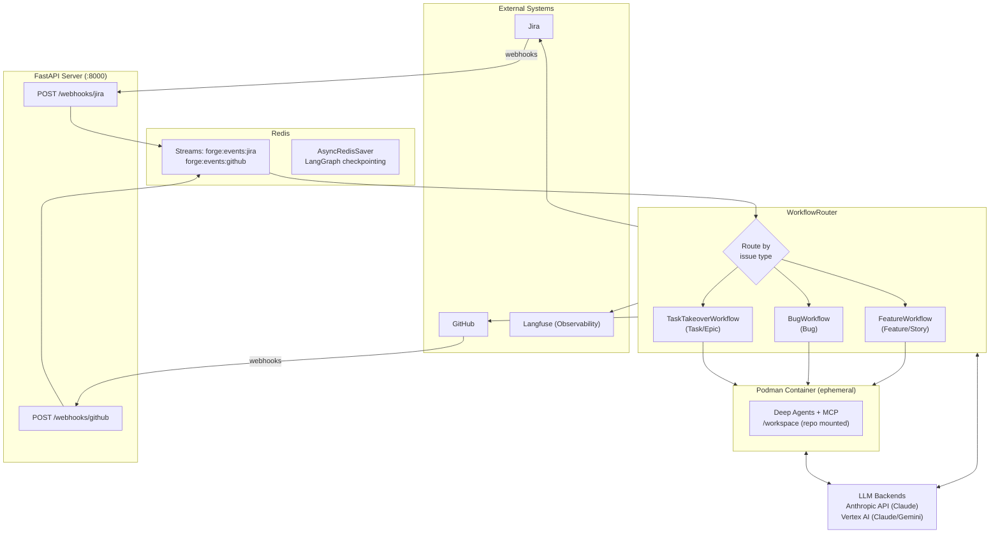
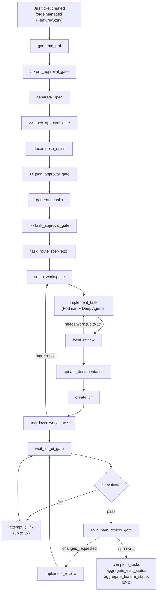
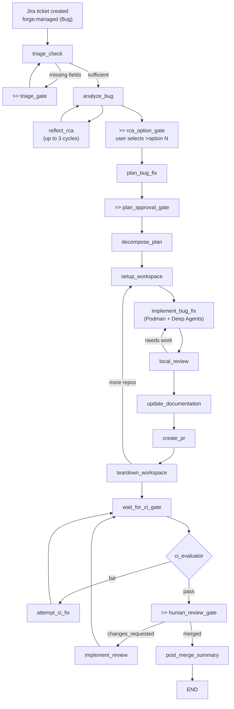
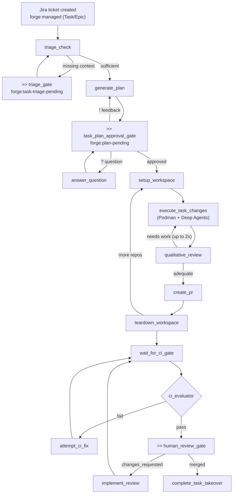

# Forge Architecture

## System Overview

## Feature Ticket Lifecycle

`>>` = human checkpoint (auto-approved when `forge:yolo` label is set)

## Bug Ticket Lifecycle

## Task Ticket Lifecycle

## Data Flow Summary

- **Inbound events:** Jira/GitHub webhooks --> FastAPI --> Redis Streams
- **State persistence:** Redis (LangGraph AsyncRedisSaver, keyed by ticket)
- **LLM calls:** Orchestrator nodes and container agents --> Claude/Gemini (Anthropic / Vertex AI), bidirectional
- **Code execution:** implement_task --> Podman container --> Deep Agents (library)
- **Outbound actions:** Jira (comments, labels, transitions), GitHub (PRs, branches, reviews)
- **Observability:** Langfuse (LLM traces, workflow spans, costs)
