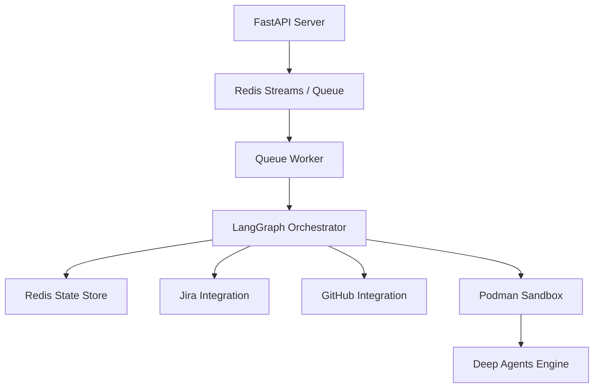

# Architecture

This document describes the high-level architecture of Forge, an AI-powered SDLC orchestrator that automates software development workflows using LangGraph, FastAPI, and Claude.

## System Overview

Forge is designed as a distributed, asynchronous system composed of several core modules:

## Core Modules

### 1. API Server (`src/forge/api/`)
The entry point for external webhooks. It handles webhook payloads from Jira (issue updates, comment events) and GitHub (PR comments, push events, checks) and pushes them to Redis Streams.

### 2. Event Queue (`src/forge/queue/`)
An event queuing system based on Redis Streams. It provides asynchronous processing, reliable delivery guarantees, and backpressure management.

### 3. Queue Worker & Worker Logic (`src/forge/orchestrator/worker.py`)
Consumers that pull events from Redis Streams, resolve them to specific LangGraph state instances, and resume the corresponding workflow execution.

### 4. LangGraph Orchestrator (`src/forge/orchestrator/`)
Defines the workflow graph using LangGraph. The orchestrator:
- Manages state checkpoints in Redis.
- Governs transitions between nodes (PRD generation, Spec generation, Epic decomposition, Task execution, PR creation, CI fix loop).
- Implements human-in-the-loop approval gates using Jira labels and GitHub review approval markers.

### 5. Workspace & Sandbox (`src/forge/sandbox/`)
Executes code implementation and testing in ephemeral Podman containers. It prepares a isolated local Git repository workspace, runs the implementation task via Deep Agents, verifies code changes, and commits them locally.

## Design Principles

- **State Persistence:** Every node in the workflow graph commits its state to Redis. If the process is restarted, the state is safely restored and the workflow resumes where it was left off.
- **Security Isolation:** Code changes are performed in container sandboxes without network access, shielding the core system from unauthorized or accidental resource manipulation.
- **Asymmetric Human Approval:** Automatic planning is interleaved with explicit approval gates. Humans can inspect generated PRDs or Specs and request revisions by leaving comments.
