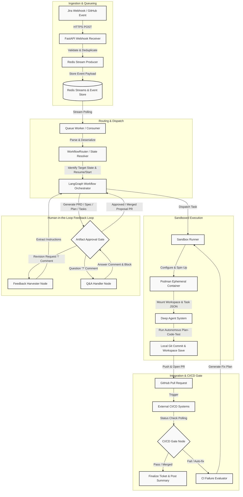
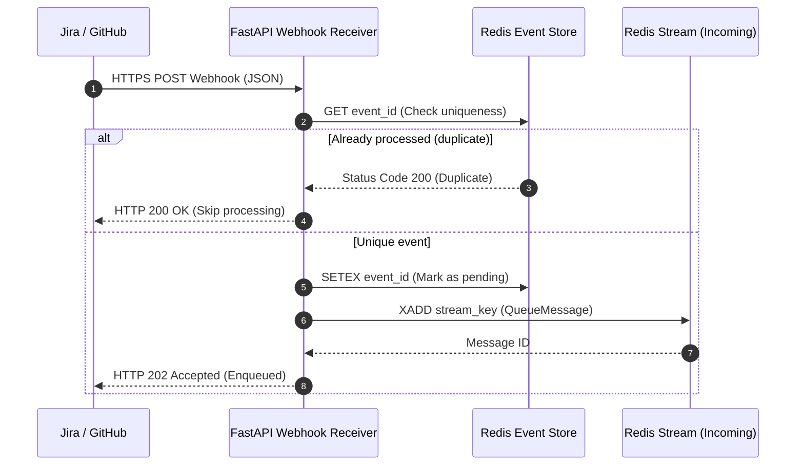
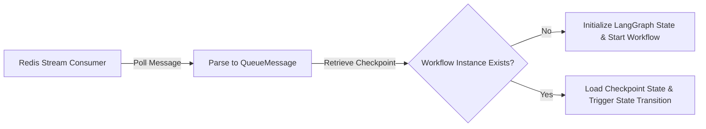
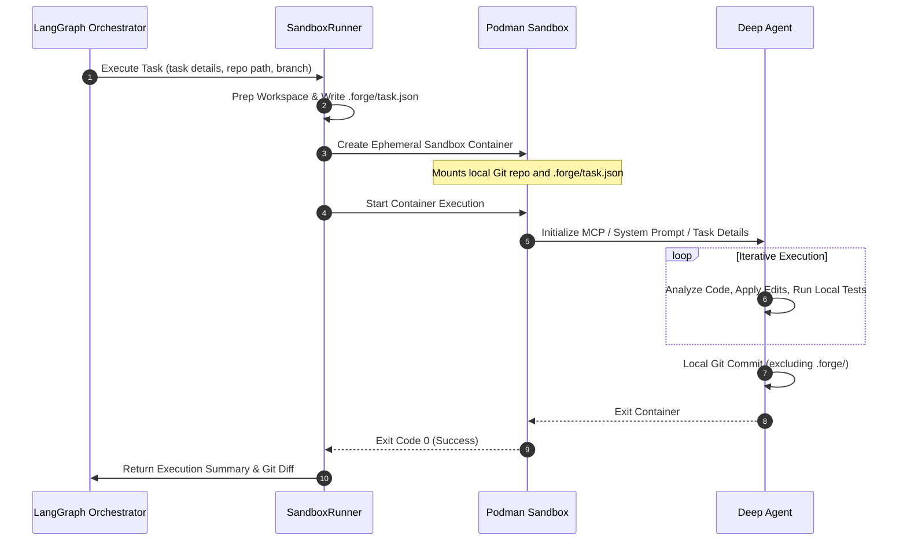
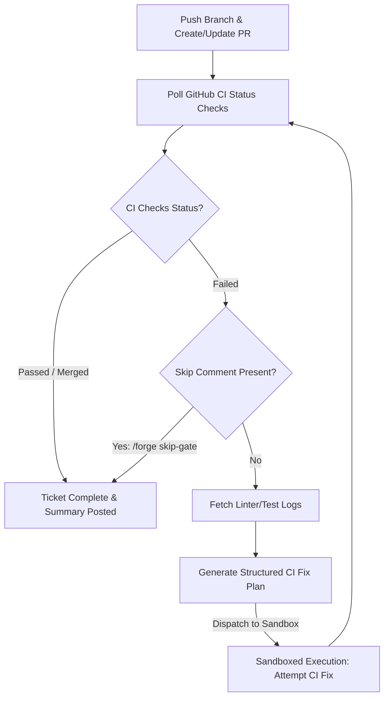
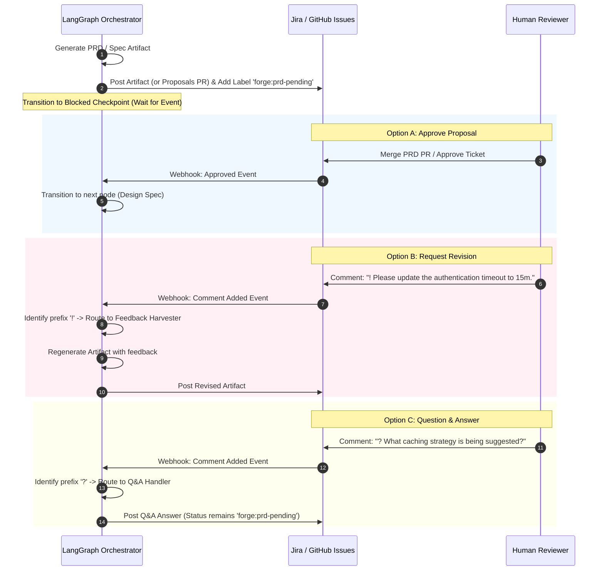

# AISOS Unified Architecture Specification (AISOS-2174)

This document provides a highly detailed, comprehensive system architecture and pipeline specification for **Forge**, the AI-powered SDLC orchestrator. Forge automates software development workflows using FastAPI, Redis, LangGraph, and Deep Agents executing within sandboxed environments.

---

## 1. Pipeline Overview & Architecture Diagram

Forge leverages a unified event-driven pipeline that integrates multi-agent systems with human review checkpoints and deterministic CI/CD gates.



---

## 2. Integration Pipeline Data Flows

### 2.1 Ingestion & Queueing
1. **Webhook Reception**: FastAPI exposes public endpoints (e.g., `/api/v1/webhooks/jira` and `/api/v1/webhooks/github`). Webhook events arrive as JSON payloads over HTTPS POST.
2. **Deduplication & Validation**: The receiver computes an event signature or checks the uniqueness of the event ID. It stores the raw event in Redis to prevent replay attacks and race conditions.
3. **Stream Production**: Validated events are serialized into standard `QueueMessage` formats and pushed onto the Redis Stream (`forge:stream:incoming`).



### 2.2 Routing & Dispatch
1. **Polling Stream**: The background queue worker running `uv run forge worker` continuously listens for incoming messages on the Redis Stream using consumer groups.
2. **Message Deserialization**: Messages are parsed into structured `QueueMessage` schemas and matched against the ticket key and active LangGraph checkpoint states.
3. **State Resolution**: The `WorkflowRouter` decides whether to start a new LangGraph instance or transition/resume an existing workflow checkpoint based on the payload fields and active labels on the ticket (e.g., `forge:managed`, `forge:prd-pending`).



### 2.3 Sandboxed Execution
1. **Container Initialization**: The orchestrator invokes the `SandboxRunner`. This runner loads configuration details, builds/ensures the base Podman image (`forge-dev:latest`), and generates container options.
2. **Task Provisioning**: Forge creates a target working directory, checks out the ticket's feature branch, and saves a specialized task instruction JSON to `.forge/task.json`.
3. **Agent Launch**: The Podman container starts, initializing Deep Agent with the system prompt from `container-system.md` and the instructions from `.forge/task.json`.
4. **Execution & Commits**: The Deep Agent carries out code generation, execution, and localized testing inside the sandbox. When complete, the agent performs a local git commit and exits. The runner copies files or persists changes directly to the host filesystem before cleanup.



### 2.4 Integration & CI/CD Gate
1. **Pull Request Stage**: The orchestrator pushes the committed changes to the origin branch and opens or updates a Pull Request (PR) on GitHub.
2. **CI Polling**: Forge polls the GitHub API for status checks (PR checks, actions, or third-party tests) to confirm if the CI gate has passed.
3. **CI Fix Attempt Loop**: If a status check fails, the `ci_evaluator` node checks whether a `/forge skip-gate <name>` command has been left in comments. If not skipped, the linter and test logs are fetched, a structured CI fix plan is generated, and execution is sent back to the Sandboxed Execution phase to repair the failure.



### 2.5 Human-in-the-Loop Feedback Loop
1. **Artifact Generation**: Nodes in LangGraph output key intermediate artifacts (e.g., PRD, Specification Design, Implementation Plans, Tasks).
2. **Approval Gate Checkpoints**: The workflow pauses, persisting its state checkpoint in Redis and transitioning the ticket labels on Jira (e.g., `forge:prd-pending`, `forge:spec-pending`).
3. **User Action / Re-entry**:
   * **Approved**: The user merges the proposal PR or transitions the Jira issue. The workflow resumes.
   * **Revision Request (`!`)**: Comments with a `!` prefix on Jira/GitHub trigger a webhook event which is routed to the `Feedback Harvester` node, triggering artifact regeneration.
   * **Question (`?` or `@forge ask`)**: Questions trigger immediate Q&A answers posted as comments while keeping the workflow in its current blocked state.



---

## 3. Dynamic Component Interfaces

### 3.1 Ingestion Payload Schema (Jira Webhook & Redis Queue JSON Parameters)

Webhook events received from Jira must conform to the ingestion standards shown below. The Redis Queue stores this structure inside a standardized `QueueMessage` container, storing string values and JSON-encoded payload fields.

#### Webhook Payload Schema (Jira Event JSON)
```json
{
  "$schema": "https://json-schema.org/draft/2020-12/schema",
  "title": "JiraWebhookPayload",
  "type": "object",
  "required": ["webhookEvent", "timestamp", "issue"],
  "properties": {
    "webhookEvent": {
      "type": "string",
      "enum": ["jira:issue_created", "jira:issue_updated", "jira:comment_created"]
    },
    "timestamp": {
      "type": "integer",
      "description": "Epoch timestamp in milliseconds"
    },
    "issue": {
      "type": "object",
      "required": ["key", "fields"],
      "properties": {
        "key": {
          "type": "string",
          "pattern": "^[A-Z0-9]+-[0-9]+$"
        },
        "fields": {
          "type": "object",
          "required": ["issuetype", "status", "summary", "description", "labels"],
          "properties": {
            "issuetype": {
              "type": "object",
              "required": ["name"],
              "properties": {
                "name": {
                  "type": "string",
                  "enum": ["Feature", "Bug", "Task"]
                }
              }
            },
            "status": {
              "type": "object",
              "required": ["name"],
              "properties": {
                "name": {
                  "type": "string"
                }
              }
            },
            "summary": {
              "type": "string"
            },
            "description": {
              "type": ["string", "null"]
            },
            "labels": {
              "type": "array",
              "items": {
                "type": "string"
              }
            },
            "comment": {
              "type": "object",
              "properties": {
                "comments": {
                  "type": "array",
                  "items": {
                    "type": "object",
                    "required": ["body", "author"],
                    "properties": {
                      "body": {
                        "type": "string"
                      },
                      "author": {
                        "type": "object",
                        "properties": {
                          "accountId": { "type": "string" },
                          "displayName": { "type": "string" }
                        }
                      }
                    }
                  }
                }
              }
            }
          }
        }
      }
    },
    "changelog": {
      "type": "object",
      "properties": {
        "items": {
          "type": "array",
          "items": {
            "type": "object",
            "required": ["field", "toString"],
            "properties": {
              "field": { "type": "string" },
              "fromString": { "type": ["string", "null"] },
              "toString": { "type": ["string", "null"] }
            }
          }
        }
      }
    },
    "user": {
      "type": "object",
      "required": ["accountId", "displayName"],
      "properties": {
        "accountId": { "type": "string" },
        "displayName": { "type": "string" }
      }
    }
  }
}
```

#### Redis Queue JSON Format
The message structure formatted for Redis storage includes:
```json
{
  "event_id": "uuid-v4-event-identifier",
  "source": "jira",
  "event_type": "jira:issue_updated",
  "ticket_key": "AISOS-123",
  "payload": "{\"webhookEvent\": \"jira:issue_updated\", \"timestamp\": 1712345678000, ...}",
  "timestamp": "2024-04-05T12:00:00.000000",
  "retry_count": "0"
}
```

---

### 3.2 Ingestion & State Resolution Boundaries

This state boundaries table maps specific responsibilities, error boundaries, state resolution policies, and structural handoffs across pipeline layers.

| Boundary Component | Layer Responsibilities | Input Interface | Output Interface & Target | State / Persistence Handling | Error Boundary & Retry Policy |
| :--- | :--- | :--- | :--- | :--- | :--- |
| **FastAPI Webhook Receiver** | Webhook verification, schema validation, event ID generation, deduplication, payload ingest. | Raw HTTPS POST Request (JSON payload, auth headers) | Formatted `QueueMessage` string-mapped dictionary to Redis. | Transient. Relies on Redis SETEX for short-term idempotency checks. | Catches serialization errors, invalid schemas, missing keys. Returns HTTP 400. No automatic retries at this edge. |
| **Redis Ingestion Stream** | Message durable ingestion queueing, sequence buffering, concurrency isolation. | Redis `XADD` command payload parameters. | Redis stream entries delivered via `XREADGROUP` consumers. | Persistent Stream data structure. Managed offset pointers per consumer group. | Redis connectivity losses are caught. Backoff connection retries are implemented by FastAPI client. |
| **WorkflowRouter** | De-queuing, payload parsing, active workflow lookup, execution branch selection (resume vs start). | Polled `QueueMessage` class from Redis Stream. | Thread ID / state triggers to LangGraph workflow instance execution. | Session checkpointer lookup. Maps `ticket_key` to LangGraph thread ID. | Invalid state lookup transitions are logged. Events with malformed keys are marked dead-lettered / failed. |
| **LangGraph Orchestrator** | State machine flow, checkpoint gating, execution node branching, LLM dispatch orchestration. | Ingested state transition triggers, event variables. | Orchestration instructions to sandbox runner, Jira status update calls. | Durable checkpoints stored in Redis checkpointer database with persistent state history. | Orchestration node faults caught at node boundaries. Failed tasks can trigger `forge:blocked` label or retry node paths. |
| **Sandbox Container Runner** | Spin up ephemeral Podman environments, prepare workspace directories, write task payloads, run agents. | Task configuration schema (`.forge/task.json`), repository root path, container image reference. | Local filesystem modifications, generated git branch changes, exit code summaries. | Transient container lifecycle. Changes committed to local git and kept only if `FORGE_CONTAINER_KEEP=true`. | Captures non-zero exit codes. Retries task run up to predefined limit or flags workflow as `forge:blocked` on hard error. |

---

## 4. Key Workflows & State Definitions

### 4.1 Workflow Label States
Forge coordinates complex human-in-the-loop gates using ticket labels:
- `forge:managed`: Target ticket is monitored and managed by the Forge pipeline.
- `forge:triage-pending`: A bug ticket is waiting to complete triage analysis.
- `forge:rca-pending`: A triaged bug ticket is waiting for the user to select an RCA option (`>option N` comment).
- `forge:prd-pending`: A feature enhancement has generated a PRD and is awaiting approval.
- `forge:spec-pending`: A technical specification has been generated and is awaiting approval.
- `forge:plan-pending`: An implementation plan is awaiting review.
- `forge:task-pending`: Decomposed tasks are waiting for user verification.
- `forge:blocked`: Human review, tool failure, or merge conflict has blocked workflow execution.
- `forge:retry`: Re-trigger the active blocked state.
- `forge:yolo`: Skips all artifact approval gates (`prd`, `spec`, `plan`, `task`) and operates autonomously up to CI verification.

---

## 5. Summary of Compliance

This specification strictly conforms to **AISOS-2174** standards:
* Valid and rendering-tested Mermaid syntax flowcharts and sequence diagrams.
* No incomplete structures or TODO blocks.
* Documented component responsibilities, schemas, and pipeline state mappings.
