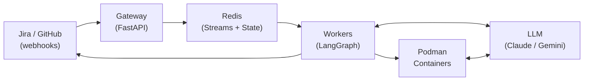
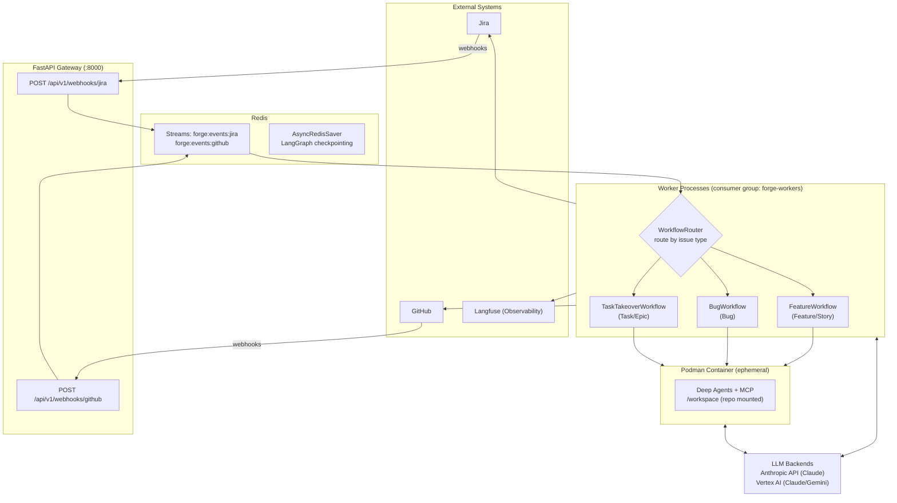

# System & Components

## Scope and Audience

This document is the primary architecture reference for Forge, an AI-powered SDLC orchestrator. It covers system structure, runtime topology, state management, failure modes, security boundaries, and key design decisions.

**Audience:** Maintainers, operators, and contributors who need to understand how Forge works, why it is built this way, and what constraints govern its operation.

**Goals:**

- Explain the runtime topology and deployment constraints
- Document state ownership, consistency guarantees, and failure recovery
- Define security and trust boundaries, especially around AI-generated code execution
- Record key architectural decisions with rationale and trade-offs
- Provide stable, high-level lifecycle views that link to detailed workflow guides

**Non-goals:**

- Node-level workflow documentation (see the [Feature](../guide/feature-workflow.md), [Bug](../guide/bug-workflow.md), and [Task](../guide/task-workflow.md) workflow guides)
- Operational runbooks or deployment procedures
- API reference (see the OpenAPI spec at `/docs` when the gateway is running)

## System Context and External Actors

Forge sits between project management (Jira), source control (GitHub), and LLM providers, orchestrating work from ticket creation through merged PR.

**External actors:**

- **Jira**: Source of ticket lifecycle events. Forge reads ticket metadata and writes comments, labels, and transitions back. Webhooks deliver issue and comment events.
- **GitHub**: Source of PR, CI, and code review events. Forge creates branches, pushes commits, opens PRs, and responds to review feedback. Webhooks deliver PR, check suite, and review events.
- **LLM providers**: Anthropic (direct API) and Google Vertex AI (Claude and Gemini models). Called by both orchestrator nodes (planning, review) and container agents (code generation).
- **Langfuse**: Observability platform for LLM call tracing, workflow spans, and cost tracking. Optional; disabled when credentials are not configured.
- **Human reviewers**: Approve or revise artifacts at defined gates. The workflow pauses indefinitely at each gate until a human responds.

## Component Responsibilities

**Gateway (FastAPI)**: Accepts Jira and GitHub webhooks over HTTPS, validates HMAC-SHA256 signatures (when secrets are configured), and publishes events to Redis Streams. It performs no workflow logic. It also serves health, readiness, and Prometheus metrics endpoints. Middleware includes CORS and correlation ID propagation. A `DeduplicationService` exists in the codebase but is not yet wired into the webhook routes (see Known Limitations in the [Reference](reference.md#known-limitations) section).

**Worker**: Consumes events from Redis Streams via the `forge-workers` consumer group. Each worker generates a unique consumer ID (`worker-{uuid}`). The `WorkflowRouter` resolves the target LangGraph workflow (Feature, Bug, or Task Takeover) based on Jira issue type and drives execution through planning, implementation, CI repair, and human review stages. Implementation runs inside ephemeral Podman containers using Deep Agents.

**Redis**: Serves multiple roles:

- *Event bus*: Redis Streams (`forge:events:jira`, `forge:events:github`) with the `forge-workers` consumer group for message distribution
- *Workflow state store*: LangGraph `AsyncRedisSaver` checkpoints workflow state per ticket (keyed by ticket key, e.g. `AISOS-123`)
- *Retry queue*: Sorted set (`forge:retry:queue`) with exponential backoff
- *Dead-letter queue*: List (`forge:retry:dlq`) for messages that exhaust retries
- *Supporting indexes*: PR-to-ticket mapping hash (`forge:state:pr_index`), webhook deduplication keys (`forge:dedup:*`, 24h TTL)

**Podman Container**: Ephemeral rootless containers that execute implementation tasks. Each container receives the target repository mounted at `/workspace` (read-write), a task file at `/task.json` (read-only), and LLM credentials as environment variables. The container runs Deep Agents with MCP tool access to make changes and commit them locally. The orchestrator handles pushing and PR creation after the container exits.

**LLM Backends**: Claude and Gemini models are called bidirectionally. Orchestrator nodes call them for planning and review; container agents call them for code generation. Two backends are supported: Anthropic's direct API (via `ANTHROPIC_API_KEY`) and Google Vertex AI (via service account credentials). The backend is selected automatically based on which credentials are configured. Request-level rate limiting uses token bucket algorithms (Anthropic: 0.5 req/s burst 5; Jira: 1.5 req/s burst 10; GitHub: 1.0 req/s burst 20).
