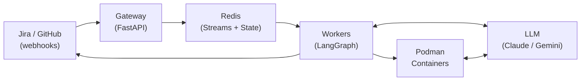
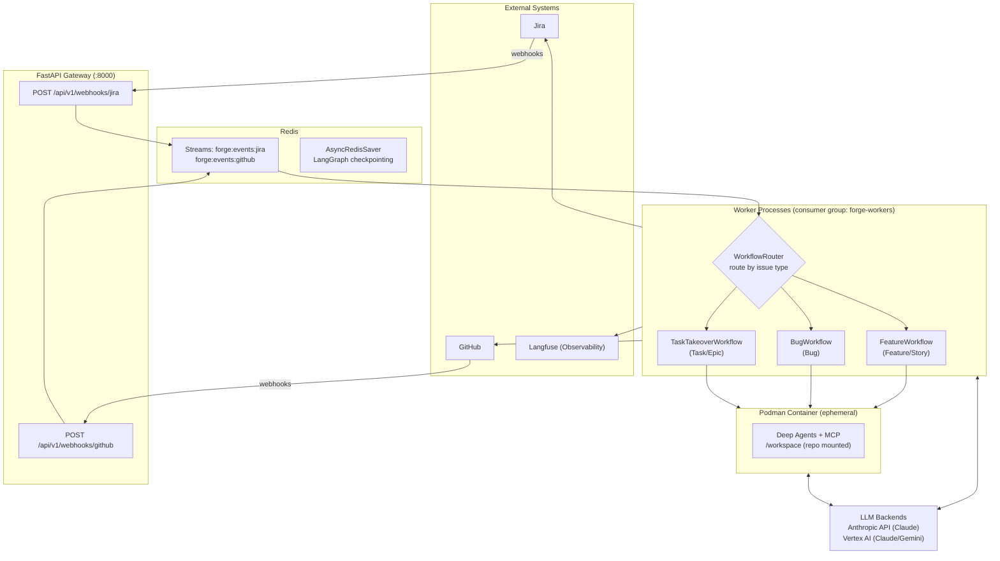

# System & Components

## System Context

Forge sits between project management (Jira), source control (GitHub), and LLM providers, orchestrating work from ticket creation through merged PR.

**External actors:**

- **Jira**: Source of ticket lifecycle events (issue and comment webhooks)
- **GitHub**: Source of PR, CI, and code review events (PR, check suite, and review webhooks)
- **LLM providers**: Anthropic (direct API) and Google Vertex AI (Claude and Gemini models)
- **Langfuse**: Optional observability for LLM call tracing and cost tracking
- **Human reviewers**: Approve or revise artifacts at defined workflow gates

## Component Responsibilities

**Gateway (FastAPI)**: Accepts webhooks over HTTPS, validates HMAC-SHA256 signatures, and publishes events to Redis Streams. Performs no workflow logic.

**Worker**: Consumes events from Redis Streams via the `forge-workers` consumer group. The `WorkflowRouter` resolves the target LangGraph workflow (Feature, Bug, or Task Takeover) based on Jira issue type and drives execution through planning, implementation, CI repair, and human review stages.

**Redis**: Event bus (Redis Streams), workflow state store (LangGraph `AsyncRedisSaver` checkpoints per ticket), retry queue, dead-letter queue, and supporting indexes (PR-to-ticket mapping, deduplication keys).

**Podman Container**: Ephemeral rootless containers that execute implementation tasks. Each container receives the repo at `/workspace` (read-write), a task file at `/task.json` (read-only), and LLM credentials. Runs Deep Agents with MCP tool access. The orchestrator handles pushing and PR creation after the container exits.

**LLM Backends**: Claude and Gemini models called by both orchestrator nodes (planning, review) and container agents (code generation). Supports Anthropic direct API and Google Vertex AI, selected automatically based on configured credentials.
