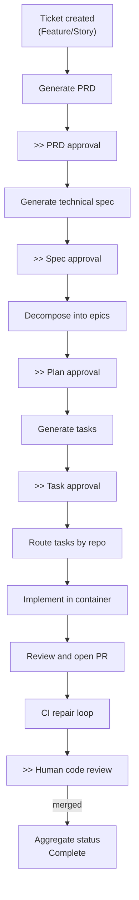
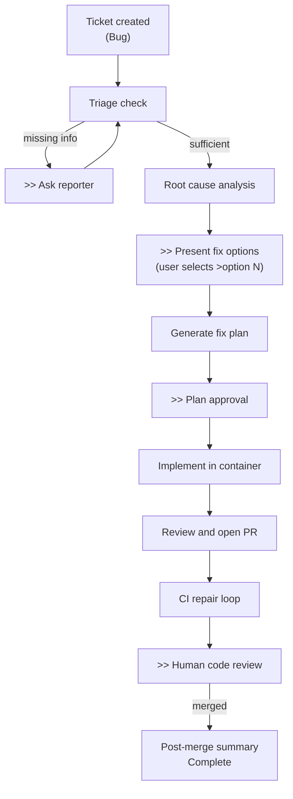
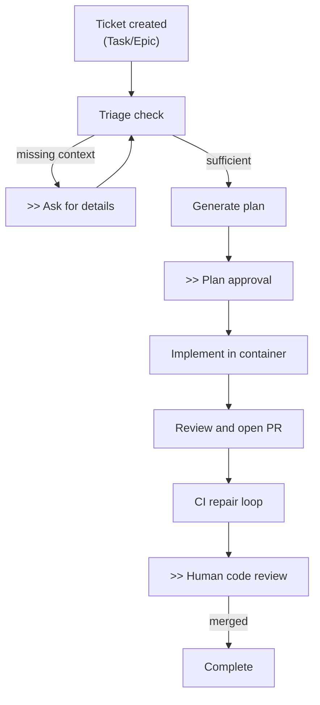

# Reference

## Quality Attributes and Operational Characteristics

### Availability

- Gateway and Worker are stateless process types (state lives in Redis). Either can restart without data loss.
- Redis is a single point of failure. Redis downtime causes complete system outage. HA must be provided externally.
- Human approval gates have no timeout. Workflows can remain paused indefinitely without consuming resources beyond Redis checkpoint storage.

### Throughput and Concurrency

- Each Worker process handles up to 20 concurrent tasks (`QUEUE_MAX_CONCURRENT_TASKS`), bounded by an `asyncio.Semaphore`.
- The consumer reads up to 10 messages per `XREADGROUP` call with a 5-second block timeout.
- Multi-repo tasks can run up to 5 concurrent repository implementations via LangGraph `Send` fan-out.
- LLM rate limiting (Anthropic: 0.5 req/s burst 5) is the primary throughput bottleneck for planning-heavy workflows.

### Per-Ticket Latency

End-to-end latency is dominated by:

- LLM response time (seconds to minutes per node, depending on prompt complexity)
- Human approval gates (minutes to days, unbounded)
- Container execution (30-minute default timeout per task)
- CI pipeline execution (external, typically 5-30 minutes)

A fully autonomous (`forge:yolo`) simple task with fast CI can complete in 10-20 minutes. A multi-epic feature with human review at each gate can take days.

### Durability

- Workflow state is durable to Redis checkpoint writes. State survives Worker restarts.
- Event durability depends on Redis persistence configuration (operator responsibility).
- External side effects (Jira comments, GitHub PRs) are durable once written to those platforms.
- Container-local changes are lost if the container exits before the orchestrator pushes them. The orchestrator pushes immediately after successful container exit.

### Auditability

- Every workflow artifact (PRD, spec, plan, tasks) is posted as a Jira comment or GitHub PR, creating a human-readable audit trail
- LLM calls are traced in Langfuse with session ID = ticket key, including token counts and costs
- OpenTelemetry tracing is available (configurable via `OTLP_ENDPOINT`)
- Worker logs include correlation IDs for request tracing

### Known Bottlenecks

- **LLM rate limits**: The Anthropic rate limiter (0.5 req/s) serializes LLM calls across all concurrent tasks within a worker
- **Single Redis**: All state, queuing, and coordination goes through one Redis instance with no sharding
- **Container spawn overhead**: Podman container creation, repo cloning, and dependency installation add minutes per task

## Key Architectural Decisions

### Redis Streams for Event Bus

**Decision:** Use Redis Streams with consumer groups instead of a dedicated message broker (RabbitMQ, Kafka).

**Rationale:** Redis already serves as the checkpoint store and index. Using it for event queuing eliminates an additional infrastructure dependency. Consumer groups provide the needed delivery semantics (at-least-once, consumer-level distribution). The tradeoff is that Redis Streams lack built-in dead-letter queues, durable replay, and cross-datacenter replication; these are acceptable given Forge's current scale.

### LangGraph for Workflow Orchestration

**Decision:** Use LangGraph `StateGraph` with `AsyncRedisSaver` checkpointing instead of a traditional workflow engine (Temporal, Airflow).

**Rationale:** LangGraph provides native support for LLM-driven decision nodes, conditional routing, and checkpointed pause/resume. The Python-native graph definition allows workflow logic to live alongside the orchestration code. The tradeoff is a less mature ecosystem and fewer operational tools compared to established workflow engines.

### Host-Level Podman for Code Execution

**Decision:** Run implementation tasks in Podman containers on the Worker host instead of using Kubernetes jobs, remote VMs, or in-process execution.

**Rationale:** Rootless Podman provides process isolation, filesystem isolation, and resource limits without requiring a Kubernetes cluster. Workers must run on Podman-capable hosts, which constrains deployment options but simplifies the container lifecycle (local spawn, local cleanup). The tradeoff is that horizontal scaling requires Podman on every Worker host.

### Workflow Separation by Issue Type

**Decision:** Maintain three separate LangGraph workflow definitions (Feature, Bug, Task Takeover) rather than a single parameterized workflow.

**Rationale:** Each workflow type has fundamentally different planning stages (PRD/spec/epic decomposition for Features, triage/RCA for Bugs, direct planning for Tasks). Separating them keeps each graph readable and independently modifiable. The shared implementation/CI/review tail is implemented as common nodes used by all three workflows. The tradeoff is some duplication in graph wiring.

### Human Approval Gates

**Decision:** Pause workflows at defined gates and wait indefinitely for human approval, rather than proceeding autonomously by default.

**Rationale:** Forge generates and executes code in real repositories. Human review at planning stages (PRD, spec, plan, tasks) and at code review catches errors before they reach production. The `forge:yolo` label provides an opt-in escape hatch for tickets where autonomous operation is acceptable. The tradeoff is increased latency and human involvement for every ticket.

## Known Limitations

- **No PEL reclaim**: If a worker crashes mid-processing, unacknowledged messages remain in the Redis PEL indefinitely. No automated `XCLAIM`/`XAUTOCLAIM` mechanism exists. Recovery requires manual intervention.
- **No distributed per-ticket lock**: Per-ticket event serialization uses an in-process `asyncio.Lock`. Multiple Worker processes can process events for the same ticket concurrently, potentially causing checkpoint conflicts or duplicate side effects.
- **Webhook deduplication not wired**: A `DeduplicationService` exists but is not connected to the webhook routes. Duplicate webhooks are processed as separate events.
- **Webhook signature validation is optional**: If `JIRA_WEBHOOK_SECRET` or `GITHUB_WEBHOOK_SECRET` is not configured, the corresponding endpoint accepts unsigned payloads.
- **No approval gate timeout**: Workflows paused at human gates wait indefinitely. There is no automatic escalation, expiration, or notification for stale gates.
- **Single Redis dependency**: No Sentinel, Cluster, or HA configuration. Redis is a single point of failure.
- **Container security hardening gaps**: No `--cap-drop ALL`, `--no-new-privileges`, `--read-only` root filesystem, or explicit seccomp profile. Relies on Podman rootless defaults.
- **No cross-stream ordering**: Events from the Jira and GitHub streams are consumed independently. No ordering guarantee exists across streams for the same ticket.

## Workflow Lifecycles

The diagrams below show the high-level lifecycle for each workflow type. `>>` marks human approval gates where the workflow pauses until a reviewer approves, requests revisions (`!` comment), or asks questions (`?` comment). Gates are auto-approved when the `forge:yolo` label is set.

These diagrams show the primary flow at a stable abstraction level. Error handling, revision loops, and question-answering branches are omitted. For detailed node-level flows with all branches, see the individual workflow guides:

- [Feature Workflow Guide](../guide/feature-workflow.md)
- [Bug Workflow Guide](../guide/bug-workflow.md)
- [Task Workflow Guide](../guide/task-workflow.md)

### Feature Lifecycle

A Feature or Story goes through a full planning pipeline before implementation. Each planning artifact is reviewed and approved by a human before proceeding.

### Bug Lifecycle

A Bug goes through triage and root cause analysis before implementation. The reporter may be asked to fill in missing context, and the user selects a fix approach from multiple options.

### Task Lifecycle

A Task or Epic goes directly from triage to implementation planning, skipping PRD, spec, and epic decomposition.

### Diagram Maintenance

The lifecycle diagrams above use stable, high-level step names rather than concrete graph node names. The source of truth for node-level workflow details is the graph definition code in `src/forge/orchestrator/`. When graph node names or edges change, the detailed workflow guides should be updated; these high-level diagrams should only change when the overall lifecycle structure changes.

## Data Flow Summary

- **Inbound events:** Jira/GitHub webhooks --> FastAPI gateway --> Redis Streams
- **State persistence:** Redis (`AsyncRedisSaver`, keyed by Jira ticket key)
- **LLM calls:** Orchestrator nodes and container agents --> Claude/Gemini (Anthropic direct API or Vertex AI)
- **Code execution:** Workflow node --> Podman container --> Deep Agents with MCP tools
- **Outbound actions:** Jira (comments, labels, transitions), GitHub (branches, commits, PRs, reviews)
- **Observability:** Langfuse (LLM traces, workflow spans, costs), OpenTelemetry (configurable)
