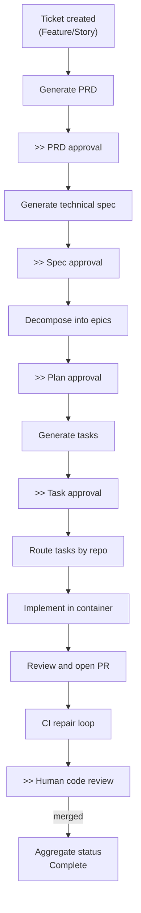
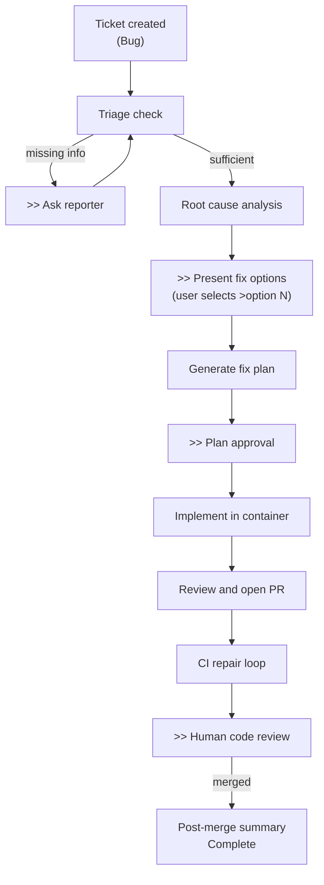
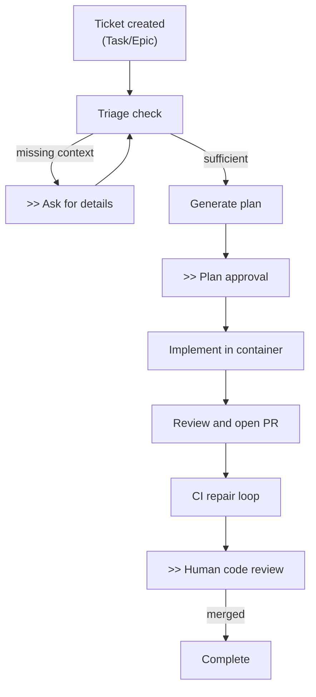

# Reference

## Key Architectural Decisions

### Redis Streams for Event Bus

Use Redis Streams with consumer groups instead of a dedicated message broker (RabbitMQ, Kafka). Redis already serves as the checkpoint store, so reusing it for event queuing eliminates an infrastructure dependency. The tradeoff: no built-in dead-letter queues or cross-datacenter replication.

### LangGraph for Workflow Orchestration

Use LangGraph `StateGraph` with `AsyncRedisSaver` checkpointing instead of Temporal or Airflow. LangGraph provides native LLM-driven decision nodes, conditional routing, and checkpointed pause/resume. The tradeoff: a less mature ecosystem with fewer operational tools.

### Host-Level Podman for Code Execution

Run implementation tasks in rootless Podman containers on the Worker host instead of Kubernetes jobs or remote VMs. This simplifies the container lifecycle but requires Podman on every Worker host.

### Workflow Separation by Issue Type

Three separate LangGraph workflow definitions (Feature, Bug, Task Takeover) rather than one parameterized workflow. Each has fundamentally different planning stages. Shared implementation/CI/review nodes are reused across all three.

### Human Approval Gates

Workflows pause at defined gates and wait indefinitely for human approval. The `forge:yolo` label provides an opt-in escape hatch for autonomous operation. The tradeoff: increased latency for every ticket.

## Known Limitations

- **No PEL reclaim**: Unacknowledged messages from crashed workers remain in Redis PEL indefinitely. Recovery requires manual `XCLAIM`.
- **No distributed per-ticket lock**: Multiple workers can process events for the same ticket concurrently, causing potential checkpoint conflicts.
- **Webhook deduplication not wired**: `DeduplicationService` exists but is not connected to webhook routes.
- **Webhook signature validation is optional**: Endpoints accept unsigned payloads when secrets are not configured.
- **No approval gate timeout**: Paused workflows wait indefinitely with no escalation.
- **Single Redis dependency**: No Sentinel, Cluster, or HA. Redis is a single point of failure.
- **Container security hardening gaps**: No `--cap-drop ALL`, `--no-new-privileges`, or `--read-only` root filesystem.
- **No cross-stream ordering**: Jira and GitHub streams are consumed independently with no ordering guarantee.

## Workflow Lifecycles

`>>` marks human approval gates. Gates are auto-approved when the `forge:yolo` label is set. For detailed node-level flows, see the [Feature](../guide/feature-workflow.md), [Bug](../guide/bug-workflow.md), and [Task](../guide/task-workflow.md) workflow guides.

### Feature Lifecycle

### Bug Lifecycle

### Task Lifecycle

