## Bug Workflow State Machine Diagram & Detail

Below is the detailed, 1:1 code-aligned state machine diagram representing the full Bug Workflow managed in `src/forge/workflow/bug/graph.py`.

```mermaid
flowchart TD
    %% Styling and classes
    classDef planning fill:#E1F5FE,stroke:#01579B,stroke-width:2px;
    classDef execution fill:#E8F5E9,stroke:#1B5E20,stroke-width:2px;
    classDef cicd fill:#FFF3E0,stroke:#E65100,stroke-width:2px;
    classDef human fill:#EDE7F6,stroke:#4A148C,stroke-width:2px;
    classDef qa fill:#FFFDE7,stroke:#F57F17,stroke-width:2px;
    classDef terminal fill:#FFEBEE,stroke:#B71C1C,stroke-width:2px;

    %% Nodes
    route_entry([route_entry]):::planning
    
    %% Triage Phase
    triage_check[triage_check]:::planning
    triage_gate[triage_gate/Pause]:::planning

    %% Analysis + Reflection Phase
    analyze_bug[analyze_bug/Container]:::planning
    reflect_rca[reflect_rca/Container]:::planning
    
    %% RCA Option Gate Phase
    rca_option_gate[rca_option_gate/Pause]:::planning
    regenerate_rca[regenerate_rca]:::planning

    %% Planning Phase
    plan_bug_fix[plan_bug_fix/Container]:::planning
    plan_approval_gate[plan_approval_gate/Pause]:::planning
    regenerate_plan[regenerate_plan]:::planning
    decompose_plan[decompose_plan]:::planning

    %% Q&A Node
    answer_question[answer_question]:::qa

    %% Backward-compat Execution / Implementation Stage
    setup_workspace[setup_workspace]:::execution
    implement_bug_fix[implement_bug_fix/Container]:::execution
    local_review[local_review]:::execution
    update_documentation[update_documentation]:::execution
    create_pr[create_pr]:::execution
    teardown_workspace[teardown_workspace]:::execution

    %% CI/CD Stage
    wait_for_ci_gate[wait_for_ci_gate/Pause]:::cicd
    ci_evaluator[ci_evaluator]:::cicd
    attempt_ci_fix[attempt_ci_fix]:::cicd
    escalate_blocked[escalate_blocked]:::cicd

    %% Review Stage
    human_review_gate[human_review_gate/Pause]:::human
    implement_review[implement_review]:::human
    review_response_gate[review_response_gate]:::human
    
    %% Post-Merge Stage
    post_merge_summary[post_merge_summary]:::human
    
    %% Terminal State
    END_STATE([END]):::terminal

    %% ── Transitions ──
    %% Entry Routing
    route_entry --> triage_check
    route_entry --> triage_gate
    route_entry --> analyze_bug
    route_entry --> reflect_rca
    route_entry --> rca_option_gate
    route_entry --> plan_bug_fix
    route_entry --> plan_approval_gate
    route_entry --> regenerate_plan
    route_entry --> decompose_plan
    route_entry --> setup_workspace
    route_entry --> implement_bug_fix
    route_entry --> local_review
    route_entry --> update_documentation
    route_entry --> create_pr
    route_entry --> teardown_workspace
    route_entry --> wait_for_ci_gate
    route_entry --> ci_evaluator
    route_entry --> human_review_gate
    route_entry --> implement_review
    route_entry --> review_response_gate
    route_entry --> post_merge_summary
    route_entry --> escalate_blocked
    route_entry --> END_STATE

    %% Triage Flow
    triage_check --> _route_after_triage_check{Route}
    _route_after_triage_check -->|triage_check| triage_check
    _route_after_triage_check -->|triage_gate| triage_gate
    _route_after_triage_check -->|analyze_bug| analyze_bug
    _route_after_triage_check -->|escalate_blocked| escalate_blocked

    triage_gate --> route_triage_gate{Route}
    route_triage_gate -->|END| END_STATE
    route_triage_gate -->|triage_check| triage_check

    %% Analysis + Reflection Loop (Self-Correction Loop)
    analyze_bug --> _route_after_analyze_bug{Route}
    _route_after_analyze_bug -->|reflect_rca| reflect_rca
    _route_after_analyze_bug -->|escalate_blocked| escalate_blocked
    _route_after_analyze_bug -->|END| END_STATE

    reflect_rca --> _route_after_reflect_rca{Route}
    _route_after_reflect_rca -->|analyze_bug| analyze_bug
    _route_after_reflect_rca -->|rca_option_gate| rca_option_gate
    _route_after_reflect_rca -->|escalate_blocked| escalate_blocked
    _route_after_reflect_rca -->|END| END_STATE

    %% RCA Option Gate
    rca_option_gate --> route_rca_option{Route}
    route_rca_option -->|plan_bug_fix| plan_bug_fix
    route_rca_option -->|regenerate_rca| regenerate_rca
    route_rca_option -->|answer_question| answer_question
    route_rca_option -->|END| END_STATE

    regenerate_rca --> analyze_bug

    %% Planning Phase
    plan_bug_fix --> _route_after_plan_bug_fix{Route}
    _route_after_plan_bug_fix -->|plan_approval_gate| plan_approval_gate
    _route_after_plan_bug_fix -->|plan_bug_fix| plan_bug_fix
    _route_after_plan_bug_fix -->|escalate_blocked| escalate_blocked
    _route_after_plan_bug_fix -->|END| END_STATE

    plan_approval_gate --> route_plan_approval{Route}
    route_plan_approval -->|decompose_plan| decompose_plan
    route_plan_approval -->|regenerate_plan| regenerate_plan
    route_plan_approval -->|answer_question| answer_question
    route_plan_approval -->|END| END_STATE

    regenerate_plan --> _route_after_regenerate_plan{Route}
    _route_after_regenerate_plan -->|plan_approval_gate| plan_approval_gate
    _route_after_regenerate_plan -->|regenerate_plan| regenerate_plan
    _route_after_regenerate_plan -->|escalate_blocked| escalate_blocked
    _route_after_regenerate_plan -->|END| END_STATE

    decompose_plan --> _route_after_decompose_plan{Route}
    _route_after_decompose_plan -->|setup_workspace| setup_workspace
    _route_after_decompose_plan -->|escalate_blocked| escalate_blocked
    _route_after_decompose_plan -->|END| END_STATE

    %% Q&A Node Routing
    answer_question --> _route_after_answer_bug{Route}
    _route_after_answer_bug -->|triage_gate| triage_gate
    _route_after_answer_bug -->|rca_option_gate| rca_option_gate
    _route_after_answer_bug -->|plan_approval_gate| plan_approval_gate

    %% Backward-compat Execution / Implementation Flow
    setup_workspace --> _route_after_workspace_setup{Route}
    _route_after_workspace_setup -->|implement_bug_fix| implement_bug_fix
    _route_after_workspace_setup -->|escalate_blocked| escalate_blocked

    implement_bug_fix --> _route_after_implementation{Route}
    _route_after_implementation -->|local_review| local_review
    _route_after_implementation -->|implement_bug_fix| implement_bug_fix
    _route_after_implementation -->|escalate_blocked| escalate_blocked

    local_review --> _route_after_local_review{Route}
    _route_after_local_review -->|local_review| local_review
    _route_after_local_review -->|update_documentation| update_documentation
    _route_after_local_review -->|create_pr| create_pr
    _route_after_local_review -->|implement_bug_fix| implement_bug_fix

    update_documentation --> create_pr

    create_pr --> _route_after_pr_creation{Route}
    _route_after_pr_creation -->|teardown_workspace| teardown_workspace
    _route_after_pr_creation -->|escalate_blocked| escalate_blocked

    teardown_workspace --> _route_after_teardown{Route}
    _route_after_teardown -->|setup_workspace| setup_workspace
    _route_after_teardown -->|wait_for_ci_gate| wait_for_ci_gate

    %% CI/CD Flow
    wait_for_ci_gate --> wait_for_ci_gate_route{Route}
    wait_for_ci_gate_route -->|END| END_STATE
    wait_for_ci_gate_route -->|ci_evaluator| ci_evaluator

    ci_evaluator --> _route_ci_evaluation{Route}
    _route_ci_evaluation -->|human_review_gate| human_review_gate
    _route_ci_evaluation -->|attempt_ci_fix| attempt_ci_fix
    _route_ci_evaluation -->|escalate_blocked| escalate_blocked
    _route_ci_evaluation -->|END| END_STATE

    attempt_ci_fix --> attempt_ci_fix_route{Route}
    attempt_ci_fix_route -->|wait_for_ci_gate| wait_for_ci_gate
    attempt_ci_fix_route -->|escalate_blocked| escalate_blocked
    attempt_ci_fix_route -->|ci_evaluator| ci_evaluator

    escalate_blocked --> END_STATE

    %% Review Flow
    human_review_gate --> _route_human_review_bug{Route}
    _route_human_review_bug -->|implement_review| implement_review
    _route_human_review_bug -->|post_merge_summary| post_merge_summary
    _route_human_review_bug -->|complete_tasks| post_merge_summary
    _route_human_review_bug -->|END| END_STATE

    implement_review --> implement_review_route{Route}
    implement_review_route -->|wait_for_ci_gate| wait_for_ci_gate
    implement_review_route -->|review_response_gate| review_response_gate
    implement_review_route -->|implement_review| implement_review
    implement_review_route -->|human_review_gate| human_review_gate
    implement_review_route -->|escalate_blocked| escalate_blocked

    review_response_gate --> route_review_response{Route}
    route_review_response -->|implement_review| implement_review
    route_review_response -->|human_review_gate| human_review_gate
    route_review_response -->|END| END_STATE

    %% Post-Merge State
    post_merge_summary --> END_STATE
```

### Detailed Bug Workflow Stages

The Bug Workflow consists of five primary architectural stages plus a legacy execution track to support in-flight runs.

#### 1. Triage Stage
* **`triage_check`**: Automatically validates the reported bug ticket details against a seven-field completeness checklist. If the ticket is detailed enough, it transitions to `analyze_bug`.
* **`triage_gate`**: If details are missing, the workflow transitions to this paused state. It applies the `forge:triage-pending` label to the Jira ticket and pauses execution. Upon user edits to the ticket, the workflow resumes via `route_entry` and routes back here to recheck and resume triage.

#### 2. RCA Analysis & Reflection Loop (Self-Correction Loop)
* **`analyze_bug`**: Spawns an isolated Podman sandbox container to clone the target repository, run diagnostic steps, and draft a structured Root Cause Analysis (`rca.json`). If the container fails, the workflow supports retries (up to 3 times) before escalating. On success, it routes to `reflect_rca`.
* **`reflect_rca`**: Performs automated self-correction. A reflection sandbox validates the accuracy and existence of code locations and the plausibility of options generated in `analyze_bug`.
  * **Self-Correction Feedback Loop**: If `reflect_rca` produces a critique and the reflection count is below the maximum limit (3 attempts), it routes back to `analyze_bug` with the critiques injected. The re-triggered `analyze_bug` refines the analysis.
  * **Loop Exit**: If the analysis is found valid or the maximum reflection limit is reached, the state machine exits the loop and transitions to `rca_option_gate`.

#### 3. RCA Option Gate Stage
* **`rca_option_gate`**: Publishes the validated RCA to Jira, labels the ticket `forge:rca-pending`, and pauses execution to wait for user input.
* **`regenerate_rca`**: If the user provides feedback (prefixed with `!`), the workflow routes here to clear the current state and trigger a fresh analysis in `analyze_bug` incorporating the feedback.

#### 4. Bug Fix Planning Stage
* **`plan_bug_fix`**: Generates a detailed step-by-step fix plan mapping targeted code files, tests, and execution order of operations.
* **`plan_approval_gate`**: Posts the plan and transitions to a paused state (`forge:plan-pending`) waiting for human review.
* **`regenerate_plan`**: Generates a revised version of the fix plan if the reviewer requests changes (prefixed with `!`).
* **`decompose_plan`**: Once the plan is approved, this node translates the high-level plan into separate development tasks per target repository and launches independent task workflow executions (spawning task containers).

#### 5. CI/CD, Review & Post-Merge Summary Stage
* **CI/CD Gates (`wait_for_ci_gate` & `ci_evaluator`)**: Tracks remote GitHub Action runs, intercepts errors, and performs self-healing fix commits (`attempt_ci_fix`) up to 5 times.
* **`human_review_gate`**: Pauses for final manual validation of the Pull Request.
* **`post_merge_summary`**: Triggered automatically upon PR merge. It posts a comprehensive final closure summary on Jira and terminates gracefully.
