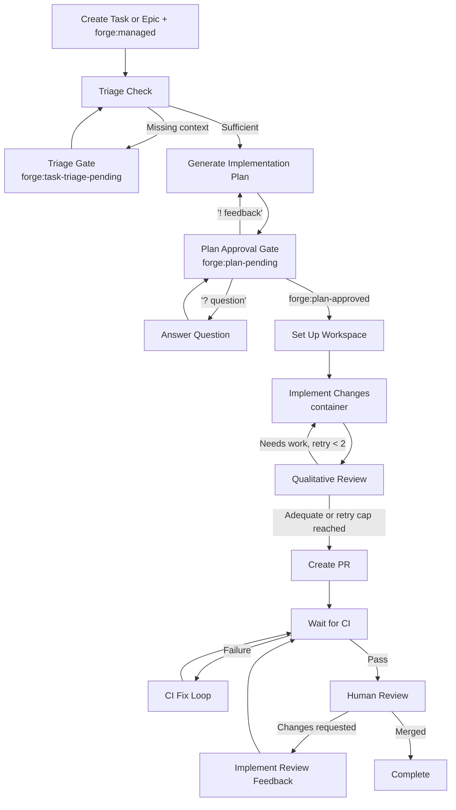

# Task Workflow

Forge can take over a standalone Jira Task or Epic and carry it from ticket triage to an implemented pull request. This workflow is for already-scoped work that does not need the full Feature pipeline or Bug RCA pipeline.

In code this workflow is named `TaskTakeoverWorkflow`. In the user guide it is documented as the Task workflow because it is the path teams use for standalone implementation tickets.

## Overview



## When to Use It

Use the Task workflow for a Jira Task or Epic when:

- The request is already concrete enough to implement directly.
- The work should produce one or more GitHub pull requests.
- You still want Forge's planning, approval, container execution, CI repair, and human PR review gates.

Use the [Feature Workflow](feature-workflow.md) when the work still needs PRD/spec/epic/task decomposition. Use the [Bug Workflow](bug-workflow.md) when the ticket needs root cause analysis and fix-option selection before implementation.

## Triggering a Task Workflow

Create or update a Jira issue with:

- **Issue type:** Task or Epic
- **Label:** `forge:managed`

Forge routes standalone managed Tasks and Epics into the Task workflow. These tickets bypass the parent Feature validation that normally applies to generated implementation tasks.

!!! note
    The same `forge:managed` label starts Feature, Bug, and Task workflows. Forge chooses the workflow from the Jira issue type.

## Stage Reference

### 1. Triage

Forge first posts an acknowledgement comment, reads the ticket summary, description, comments, and project repository configuration, then checks whether the ticket has enough actionable context.

The ticket does not need a rigid template. Small tasks can pass triage when the intent, scope, expected outcome, and repository target are clear.

**If the ticket is sufficient:** Forge posts a confirmation, records the resolved repository when possible, and starts plan generation.

**If information is missing:** Forge sets `forge:task-triage-pending`, posts a targeted list of missing information, and pauses.

To resume, reply with a comment starting with `!` and include the requested information:

```text
! This should update the billing API in acme/payments. The endpoint should reject expired tokens with 401 and the existing auth tests should cover it.
```

Forge then re-runs triage against the updated ticket context.

### 2. Plan Generation

Forge generates an implementation plan from the ticket, comments, and configured project repositories. The plan must include valid `repo:<owner>/<repo>` tags that match repositories configured for the Jira project.

The plan is posted back to Jira. Forge also applies repository labels such as `repo:acme/payments` and sets `forge:plan-pending`.

If the plan is too large for a Jira comment, Forge truncates the comment and keeps the full plan in workflow state.

### 3. Plan Approval Gate

Review the posted implementation plan before Forge changes code.

| Action | How |
|--------|-----|
| Approve | Change label to `forge:plan-approved` |
| Request revision | Comment with `!` followed by feedback |
| Ask a question | Comment with `?` or `@forge ask` |
| Leave paused | Keep `forge:plan-pending` |

Question comments route to Q&A mode and return to the same approval gate. Revision comments regenerate the plan with the previous plan and your feedback in context.

!!! tip "YOLO mode"
    If `forge:yolo` is present, Forge auto-approves the task plan and proceeds to workspace setup. Human PR review still remains a gate.

### 4. Workspace Setup

After approval, Forge creates an isolated workspace for the first repository in the approved plan. Multi-repo plans are processed one repository at a time.

The workspace state tracks the current repository, branch, completed repositories, PR URLs, CI status, and review state so the workflow can resume safely after webhooks or retries.

### 5. Implementation

Implementation runs in a container sandbox. The task prompt includes:

- The approved implementation plan
- The original Jira ticket description
- Any qualitative review feedback from a previous pass
- Instructions to inspect the codebase, make the planned changes, add or update tests, and run local validation

After the container run, Forge stages and commits workspace changes on the host. If the container reports a failure, Forge records the failure in workflow state so the next routing decision can retry or block appropriately.

### 6. Qualitative Review

Forge reviews the implemented changes before opening a PR. If the verdict is adequate, the workflow proceeds to PR creation.

If the review finds incomplete tests or a symptom-only implementation, Forge routes back to implementation with the review feedback. The Task workflow allows up to 2 qualitative review retries. If the retry cap is reached, as long as there is no active error and a successful commit was made, Forge proceeds to PR creation with the failed review state retained. If there is an active error (e.g., container execution failed) or no changes were committed, the workflow escalates to blocked (`forge:blocked`) instead of opening an empty or broken PR.

Infrastructure errors that prevent review from producing a verdict route to `forge:blocked`.

### 7. PR Creation

Forge creates a fork-based pull request for the current repository. After PR creation succeeds, Forge tears down the workspace and moves to the next repository in the approved plan.

When all repositories are processed, the workflow waits for CI.

### 8. CI/CD + Fix Loop

Forge waits for GitHub CI webhooks. If checks are still pending, the workflow stays paused. If CI passes, it proceeds to human review.

On CI failure, Forge runs the shared CI fix loop:

1. Evaluate failed checks.
2. Analyze the failure.
3. Apply a fix.
4. Push the update.
5. Wait for CI again.

To skip an infrastructure-related check, use `/forge skip-gate <name>` on the PR. See [PR Commands](pr-commands.md).

### 9. Human Review

Forge pauses at the human review gate after CI passes. Merge the PR when satisfied.

If changes are requested in GitHub review, Forge routes to the review implementation node, applies the requested changes, returns to CI, and then pauses for review again.

When the PR is merged, Forge marks the Task workflow complete.

## Comment Syntax

At the triage and plan gates, Forge classifies comments by prefix:

- **`!` prefix** - provide missing triage context or request a plan revision
- **`?` prefix or `@forge ask`** - ask a question without advancing the workflow
- **No prefix** - informational; ignored by workflow routing

The `>option N` syntax is only used by the Bug workflow RCA option gate.

## Labels

| Label | Set by | Purpose |
|-------|--------|---------|
| `forge:managed` | Human | Start the Task workflow for a standalone Task or Epic |
| `forge:task-triage-pending` | Forge | Ticket needs more actionable context before planning |
| `forge:plan-pending` | Forge | Implementation plan is posted and waiting for review |
| `forge:plan-approved` | Human | Approve the plan and start implementation |
| `forge:yolo` | Human | Auto-approve the plan gate |
| `repo:<owner>/<repo>` | Forge or Human | Repository selected for planning and implementation |
| `forge:blocked` | Forge | Workflow failed or reached a retry limit |
| `forge:retry` | Human | Resume from the failed node after fixing the underlying issue |

See [Jira Labels](labels.md) for the complete label reference.

## Failure and Retry Behavior

If a stage fails, Forge records the error, sets `forge:blocked`, and posts an error comment on the Jira ticket.

To resume, add `forge:retry`. Forge resumes from the saved `current_node` instead of restarting the workflow from triage. For CI failures, retrying gives the workflow a fresh CI-fix budget.

Planning and triage have bounded retry behavior. Qualitative review also has a bounded retry loop and will proceed to PR creation after the retry cap when it has a non-adequate verdict, preserving that state for reviewers.

