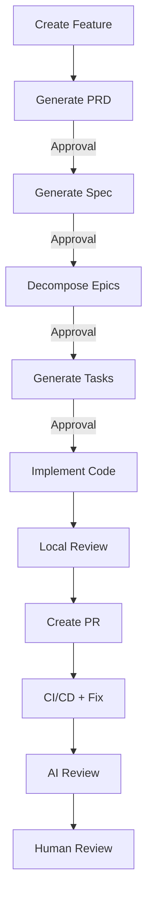

# Forge

Forge automates the software development lifecycle from feature ideation through code delivery using AI-powered planning and execution. It connects Jira, GitHub, and Claude to transform tickets into shipped code with human approval gates at each stage.

## How It Works

## Quick Links

- [Getting Started](getting-started.md) — Set up Forge in 10 minutes
- [System Architecture](architecture.md) — AISOS system architecture and data pipelines
- [Feature Workflow](guide/feature-workflow.md) — How features flow through Forge
- [Bug Workflow](guide/bug-workflow.md) — How bug diagnosis and implementation flow through Forge
- [Task Workflow](guide/task-workflow.md) — How standalone Tasks and Epics become PRs
- [Developer Guide](developer-guide.md) — Full local development reference
- [Skills System](skills/index.md) — Customize Forge for your stack
- [Contributing](dev/contributing.md) — How to contribute

## Key Features

**AI-Powered Planning**
: PRD, spec, and task generation at each stage with human approval gates before moving forward.

**Q&A Mode**
: Ask clarifying questions at any approval gate without triggering regeneration. Start a comment with `?` or `@forge ask`.

**Automated Implementation**
: Code executed in ephemeral Podman containers with no external network access.

**CI Fix Loop**
: Automatic CI failure analysis and fixing, up to 5 retries. Skip infrastructure-related failures with `/forge skip-gate`.

**Skills System**
: Customizable per-project AI behavior. Override only what's specific to your stack; defaults cover the rest.

**Resumable Workflows**
: LangGraph checkpoints state to Redis after every step. Use `forge:retry` to resume from the exact node that failed.
