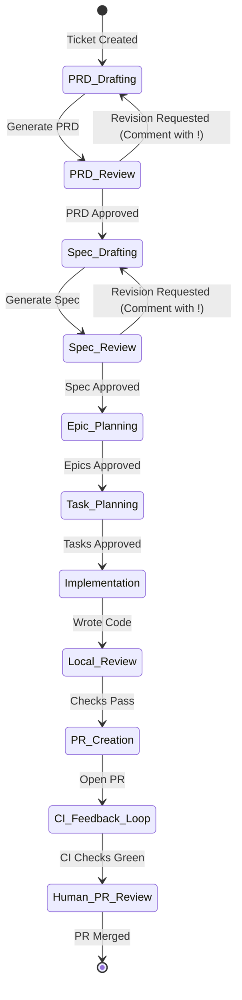
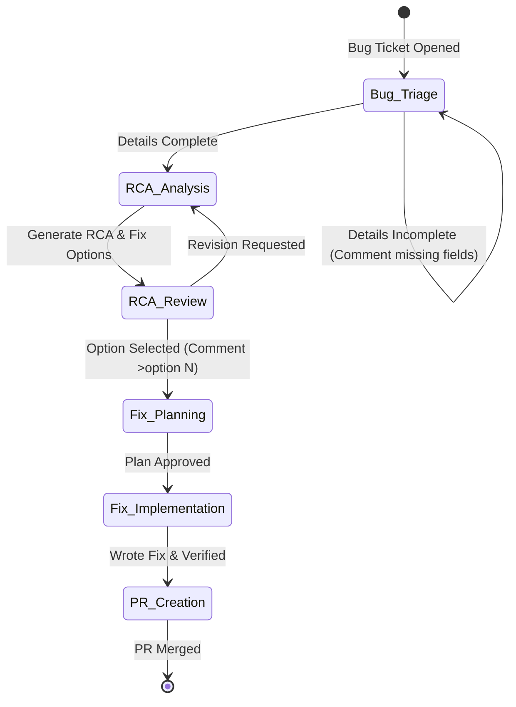

# Workflows

Forge supports two major workflows: the **Feature Workflow** and the **Bug Workflow**. Each is modeled as a LangGraph state machine with automatic planning steps and human-in-the-loop validation checkpoints.

## Feature Workflow

The Feature Workflow is used for implementing user stories, enhancements, or complex functionality.

### Key Stages

1. **PRD Generation:** Analyzes the raw Jira description and generates a structured Product Requirements Document (PRD).
2. **Specification Design:** Converts the approved PRD into a detailed technical specification with behavioral acceptance criteria.
3. **Epic Decomposition:** Breaks down the technical specification into manageable, high-level epics with individual implementation plans.
4. **Task Planning:** Decomposes the epic implementation plans into concrete, atomic execution tasks.
5. **Implementation Sandbox:** Runs a separate agent container for each task to write, test, format, and commit the code.
6. **PR Creation & CI Fix Loop:** Creates a GitHub Pull Request and enters a self-healing loop to fix any CI test failures dynamically.

---

## Bug Workflow

The Bug Workflow is highly optimized for isolating, replicating, and fixing software defects.

### Key Stages

1. **Bug Triage:** Evaluates the bug ticket for completeness (reproduction steps, expected/actual behavior, environment details).
2. **RCA Analysis:** Uses TDD methodology to write failing reproduction tests and pinpoint the exact root cause, producing multiple fix options.
3. **Option Selection:** The user reviews the fix options and selects one by posting a Jira comment like `>option 1`.
4. **Fix Implementation:** Writes the fix code, ensures the reproduction tests pass, and prepares a GitHub PR.
